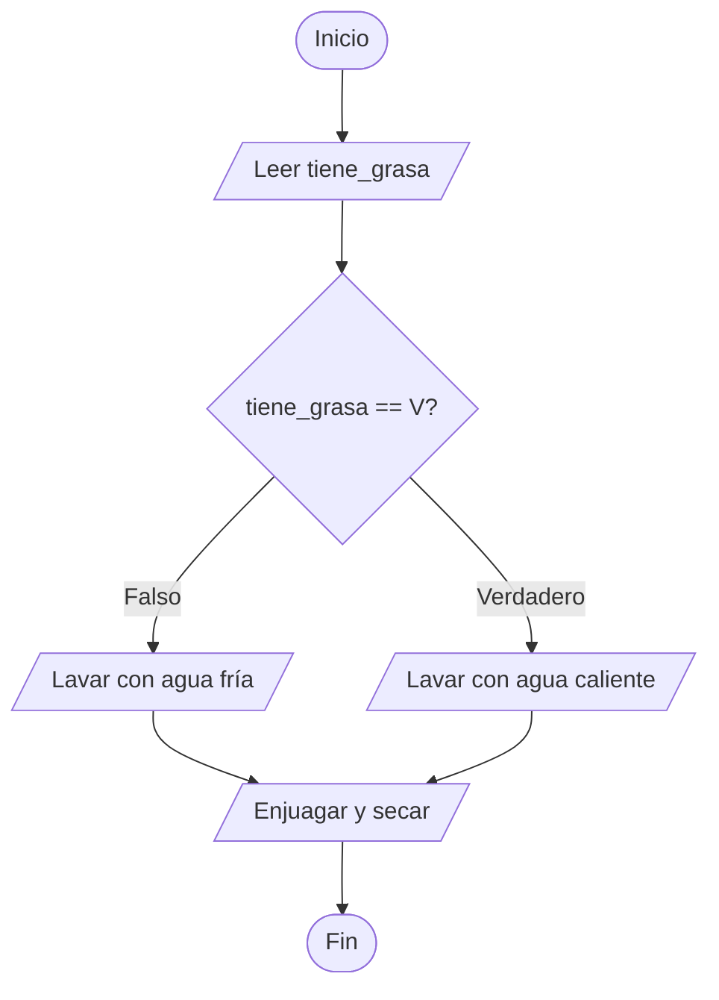
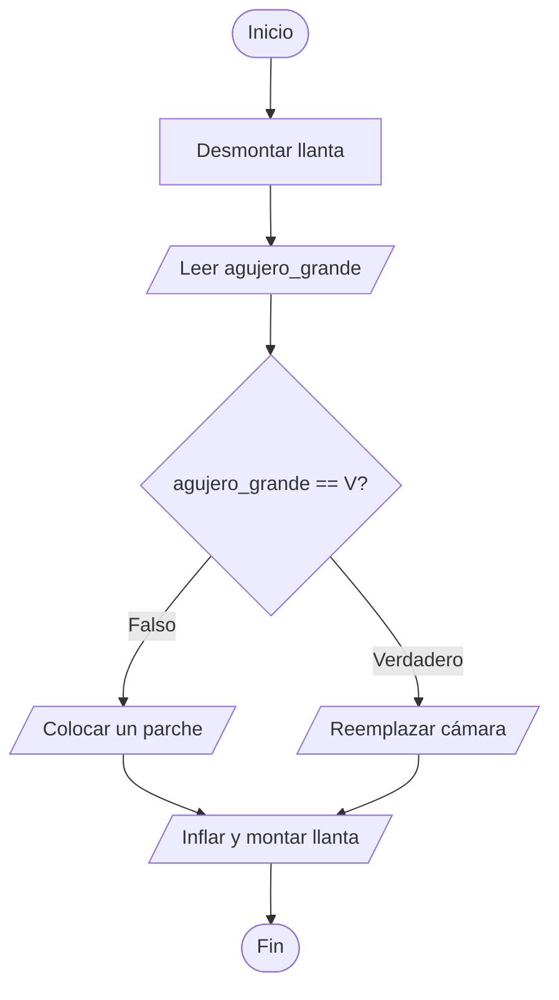
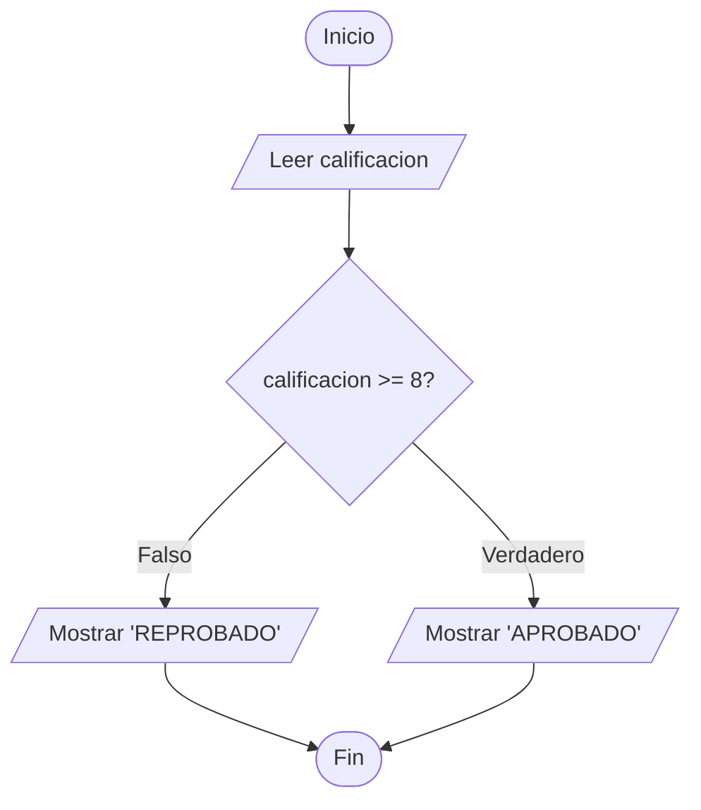
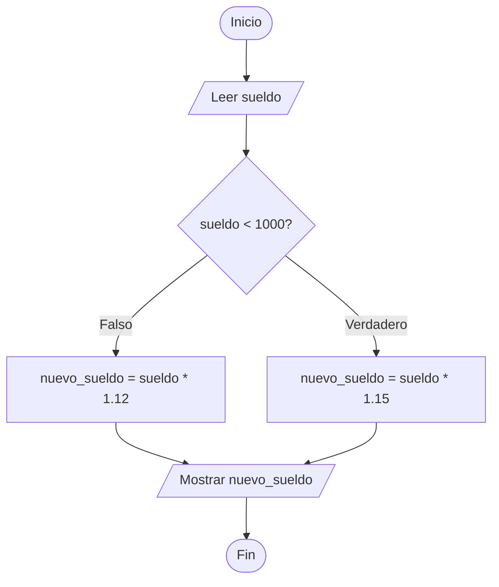
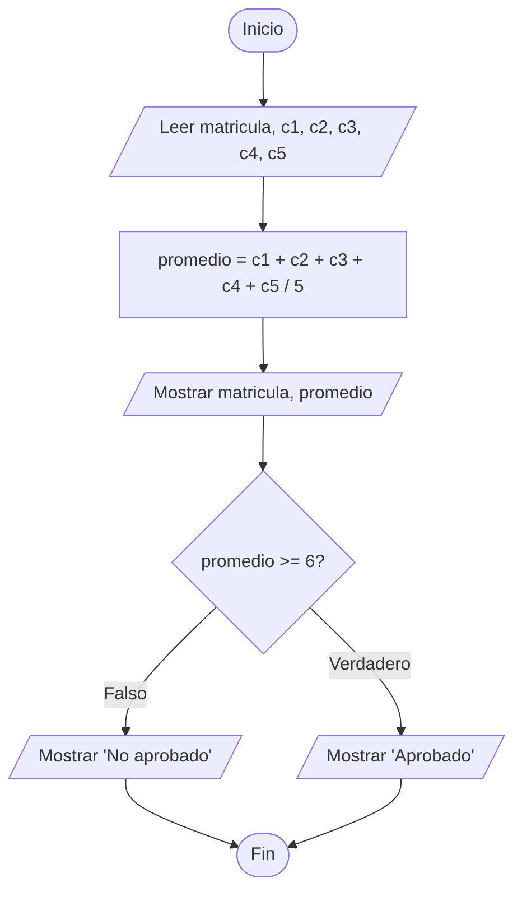
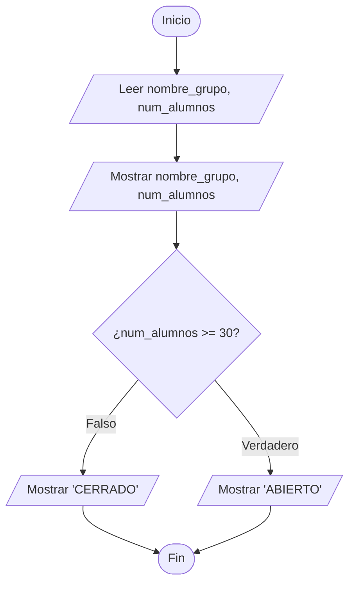
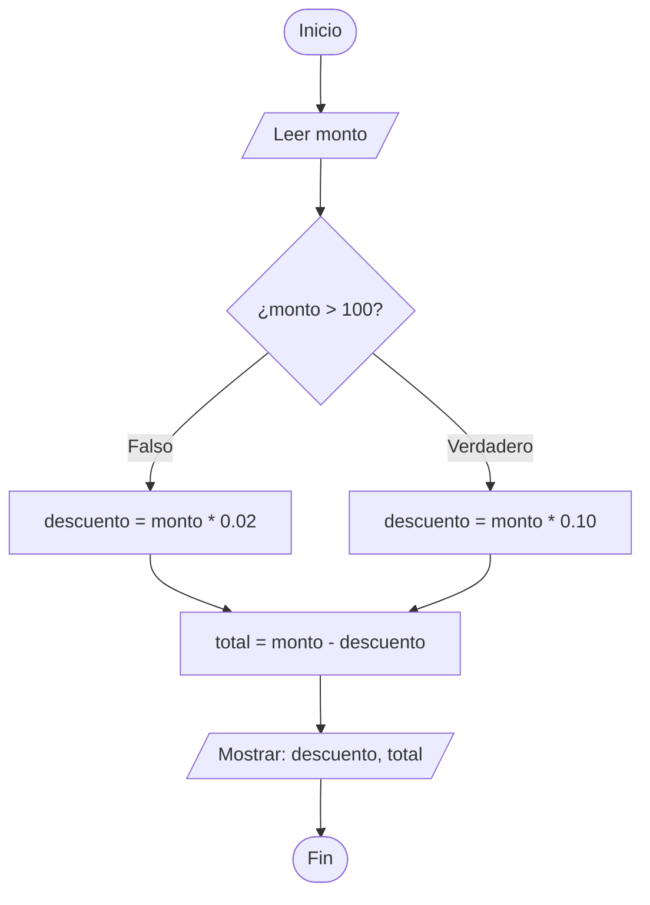
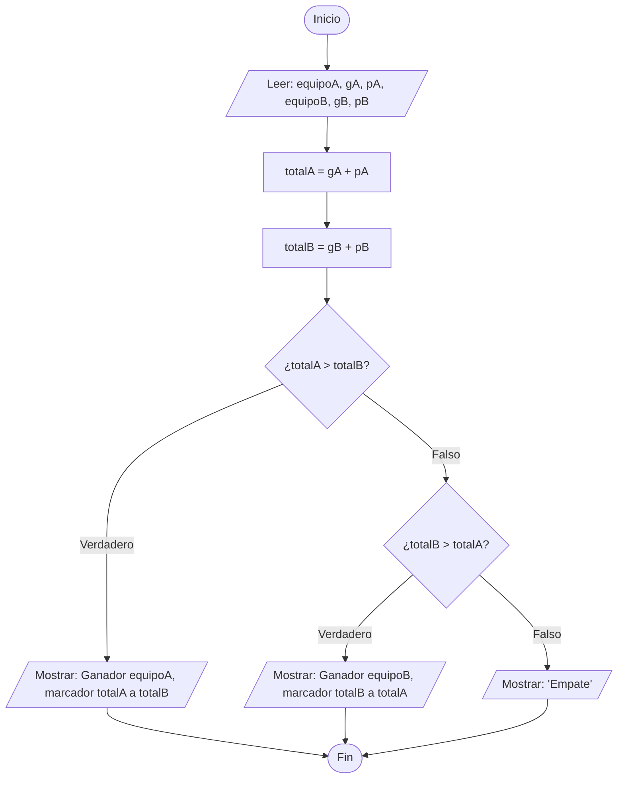
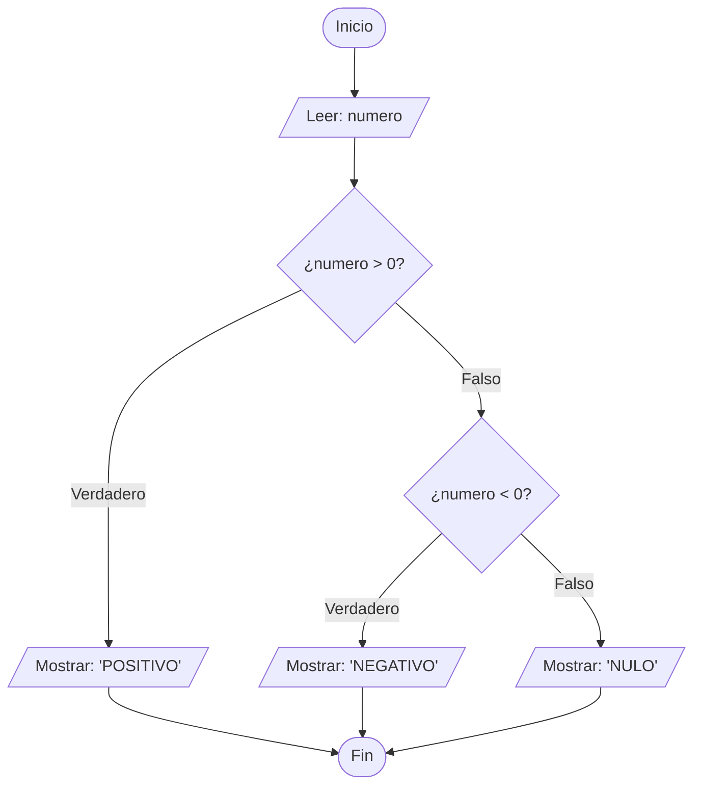
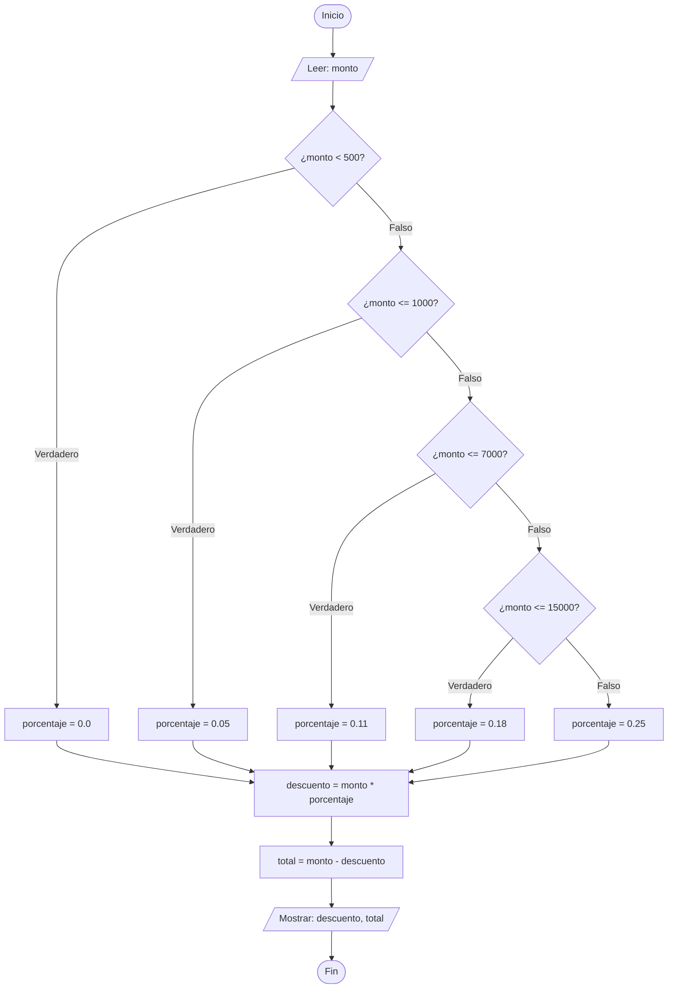

## Ejercicios IF-ELSE

## Ejercicio 1:
Escribir un algoritmo para lavar los platos de la comida.

### Análisis

- **Objetivo:** Lavar un plato determinando si necesita un tratamiento especial por exceso de grasa.
    
- **Datos de Entrada:** Estado del plato (`tiene_grasa`). Tipo de dato lógico (Verdadero/Falso).
    
- **Datos de Salida:** Acción a realizar y estado final (`plato_limpio`).
    
- **Reglas:** Si tiene mucha grasa, se lava con agua caliente. Si no, se lava con agua fría.
    

### Pseudocódigo

```Plaintext
Inicio
    Booleano: tiene_grasa
    
    Escribir "¿El plato tiene grasa? (Verdadero/Falso)"
    Leer tiene_grasa
    
    Si (tiene_grasa == Verdadero) Entonces
        Escribir "Lavar con agua caliente y mucho jabón."
    Sino
        Escribir "Lavar con agua fría y jabón normal."
    Fin Si
    
    Escribir "Enjuagar y secar el plato."
Fin
```

### Diagrama de Flujo



### Prueba de Escritorio

|**tiene_grasa**|**Acción tomada**|
|---|---|
|Verdadero|Lavar con agua caliente y mucho jabón. Enjuagar y secar el plato.|
|Falso|Lavar con agua fría y jabón normal. Enjuagar y secar el plato.|

### Código JAVA

```Java
import java.util.Scanner;

class Ejercicio01 {

    public static void main(String[] args) {
        Scanner leer = new Scanner(System.in);

        System.out.println("¿El plato tiene grasa? (True/False)");
        boolean tiene_grasa = leer.nextBoolean();

        if (tiene_grasa) {
            System.out.println("Lavar con agua caliente y mucho jabón.");
        } else {
            System.out.println("Lavar con agua fría y jabón normal.");
        }

        System.out.println("Enjuagar y secar el plato.");

        leer.close();
    }
}
```


## Ejercicio 2:
Escribir un algoritmo para reparar un pinchazo de bicicleta.

### Análisis

- **Objetivo:** Reparar la llanta decidiendo si la cámara interna sirve o debe cambiarse.
    
- **Datos de Entrada:** Condición del pinchazo (`agujero_grande`). Tipo lógico (Verdadero/Falso).
    
- **Datos de Salida:** Método de reparación.
    
- **Reglas:** Si el agujero es muy grande, se cambia la cámara entera. Si es pequeño, se le pone un parche.
    

### Pseudocódigo

```Plaintext
Inicio
    Booleano: agujero_grande
    
    Escribir "Desmontar la llanta y sacar la cámara."
    Escribir "¿El agujero es demasiado grande? (Verdadero/Falso)"
    Leer agujero_grande
    
    Si (agujero_grande == Verdadero) Entonces
        Escribir "Reemplazar la cámara por una nueva."
    Sino
        Escribir "Lijar, poner pegamento y colocar un parche."
    Fin Si
    
    Escribir "Inflar la llanta y montar en la bicicleta."
Fin
```

### Diagrama de Flujo



### Prueba de Escritorio

| **agujero_grande** | **Acción tomada**                                            |
| ------------------ | ------------------------------------------------------------ |
| Verdadero          | Reemplazar la cámara por una nueva. Inflar y montar.         |
| Falso              | Lijar, poner pegamento y colocar un parche. Inflar y montar. |

### Código JAVA

```Java
import java.util.Scanner;

class Ejercicio02 {

    public static void main(String[] args) {
        Scanner leer = new Scanner(System.in);

        System.out.println("Desmontar la llanta y sacar la cámara.");
        System.out.println("¿El agujero es demasiado grande? (True/False)");
        boolean agujero_grande = leer.nextBoolean();

        if (agujero_grande) {
            System.out.println("Reemplazar la cámara por una nueva.");
        } else {
            System.out.println("Lijar, poner pegamento y colocar un parche.");
        }

        System.out.println("Inflar la llanta y montar en la bicicleta.");

        leer.close();
    }
}

```


## Ejercicio 3:
Construya un algoritmo dado como dato la calificación de un alumno en un examen, escriba "APROBADO" si su calificación es mayor o igual que 8 y "REPROBADO" en caso contrario.

### Análisis

- **Objetivo:** Determinar si un alumno pasa la materia basado en su nota.
    
- **Datos de Entrada:** `calificacion` (número real).
    
- **Datos de Salida:** Mensaje de "APROBADO" o "REPROBADO".
    
- **Reglas:** Aprobado si la calificación es mayor o igual a 8.
    

### Pseudocódigo

```Plaintext
Inicio
    Real: calificacion
    
    Leer calificacion
    
    Si (calificacion >= 8) Entonces
        Escribir "APROBADO"
    Sino
        Escribir "REPROBADO"
    Fin Si
Fin
```

### Diagrama de Flujo



### Prueba de Escritorio

|**calificacion**|**¿calificacion >= 8?**|**Pantalla**|
|---|---|---|
|8.5|Verdadero|APROBADO|
|7.9|Falso|REPROBADO|

## Ejercicio 4:
Construya un algoritmo dado como dato el sueldo de un trabajador, aplique un aumento del 15% si su sueldo es inferior a $1,000.00 y en 12% en caso contrario. Imprima el nuevo sueldo del trabajador.

### Análisis

- **Objetivo:** Calcular el nuevo sueldo aplicando un porcentaje de aumento condicionado.
    
- **Datos de Entrada:** `sueldo` actual (número real).
    
- **Datos de Salida:** `nuevo_sueldo` (número real).
    
- **Reglas:** Si el sueldo < 1000, el aumento es del 15% (multiplicar por 1.15). Si no (>= 1000), el aumento es del 12% (multiplicar por 1.12).
    

### Pseudocódigo

```Plaintext
Inicio
    Real: sueldo, nuevo_sueldo
    
    Leer sueldo
    
    Si (sueldo < 1000) Entonces
        nuevo_sueldo <- sueldo + (sueldo * 0.15)
    Sino
        nuevo_sueldo <- sueldo + (sueldo * 0.12)
    Fin Si
    
    Escribir "El nuevo sueldo es: $", nuevo_sueldo
Fin
```

### Diagrama de Flujo



### Prueba de Escritorio

|**sueldo**|**¿sueldo < 1000?**|**Operación**|**nuevo_sueldo**|
|---|---|---|---|
|800.00|Verdadero|800 * 1.15|920.00|
|1200.00|Falso|1200 * 1.12|1344.00|

### Código JAVA

```Java
import java.util.Scanner;

class Ejercicio04 {

    public static void main(String[] args) {
        Scanner leer = new Scanner(System.in);

        System.out.println("Ingrese el sueldo del trabajador:");
        double sueldo = leer.nextDouble();
        double nuevo_sueldo;

        if (sueldo < 1000) {
            nuevo_sueldo = sueldo + (sueldo * 0.15);
        } else {
            nuevo_sueldo = sueldo + (sueldo * 0.12);
        }

        System.out.printf("El nuevo sueldo del trabajador es: " + nuevo_sueldo);

        leer.close();
    }
}
```


## Ejercicio 5:
Construya un algoritmo dado como datos la matricula y 5 calificaciones de un alumno; imprima la matricula, el promedio y la palabra "Aprobado" si el alumno tiene un promedio mayor o igual que 6, y la palabra "No aprobado", en caso contrario.

### Análisis

- **Objetivo:** Calcular el promedio de 5 notas e indicar si el alumno aprueba, mostrando también su matrícula.
    
- **Datos de Entrada:** `matricula` (texto/cadena), `c1`, `c2`, `c3`, `c4`, `c5` (números reales).
    
- **Datos de Salida:** `matricula`, `promedio`, Estado ("Aprobado" / "No aprobado").
    
- **Reglas:** Promedio = suma de calificaciones / 5. Se aprueba si el promedio es >= 6.
    

### Pseudocódigo

```Plaintext
Inicio
    Cadena: matricula
    Real: c1, c2, c3, c4, c5, promedio
    
    Leer matricula, c1, c2, c3, c4, c5
    
    promedio <- (c1 + c2 + c3 + c4 + c5) / 5
    
    Escribir "Matrícula: ", matricula
    Escribir "Promedio: ", promedio
    
    Si (promedio >= 6) Entonces
        Escribir "Aprobado"
    Sino
        Escribir "No aprobado"
    Fin Si
Fin
```

### Diagrama de Flujo



### Prueba de Escritorio

|**matricula**|**c1**|**c2**|**c3**|**c4**|**c5**|**promedio**|**Estado**|
|---|---|---|---|---|---|---|---|
|"A001"|7|8|5|6|7|6.6|Aprobado|
|"A002"|5|5|6|4|5|5.0|No aprobado|

## Ejercicio 6:
Construye un algoritmo que, dado el nombre del grupo y el numero de alumnos pre-inscritos, exprese el nombre del grupo, el numero de alumnos inscritos y si el grupo sera abierto o cerrado, puesto que, para abrir un grupo, se necesitan mínimo 30 alumnos.

### Análisis

- **Objetivo:** Definir si un grupo escolar se abre dependiendo de la cantidad de inscritos.
    
- **Datos de Entrada:** `nombre_grupo` (texto/cadena), `num_alumnos` (entero).
    
- **Datos de Salida:** `nombre_grupo`, `num_alumnos`, Estado ("Abierto" / "Cerrado").
    
- **Reglas:** Mínimo 30 alumnos para abrir (num_alumnos >= 30).
    

### Pseudocódigo

```Plaintext
Inicio
    Cadena: nombre_grupo
    Entero: num_alumnos
    
    Leer nombre_grupo, num_alumnos
    
    Escribir "Grupo: ", nombre_grupo
    Escribir "Inscritos: ", num_alumnos
    
    Si (num_alumnos >= 30) Entonces
        Escribir "El grupo será: ABIERTO"
    Sino
        Escribir "El grupo será: CERRADO"
    Fin Si
Fin
```

### Diagrama de Flujo



### Prueba de Escritorio

|**nombre_grupo**|**num_alumnos**|**¿>= 30?**|**Pantalla (Resultado)**|
|---|---|---|---|
|"Matemáticas 1"|35|Verdadero|ABIERTO|
|"Física 3"|22|Falso|CERRADO|

### Codigo JAVA

```Java
import java.util.Scanner;

class Ejercicio06 {

    public static void main(String[] args) {
        Scanner leer = new Scanner(System.in);

        System.out.println("Ingrese el nombre del grupo:");
        String nombre_grupo = leer.nextLine();

        System.out.println("Ingrese el número de alumnos pre-inscritos:");
        int num_alumnos = leer.nextInt();

        System.out.println("Grupo: " + nombre_grupo);
        System.out.println("Inscritos: " + num_alumnos);

        if (num_alumnos >= 30) {
            System.out.println("El grupo será: ABIERTO");
        } else {
            System.out.println("El grupo será: CERRADO");
        }

        leer.close();
    }
}
```


## Ejercicio 7:
Escribe un algoritmo que calcule el descuento considerando las siguientes especificaciones:

- Si el monto es mayor a $100, se aplica un descuento del 10% sobre la compra.
- Si el monto es menor a $100, se aplica un descuento del 2% sobre el monto total de la compra.

### Análisis

- **Objetivo:** Calcular el descuento de una compra según su monto.
    
- **Datos de Entrada:** `monto` de la compra (real).
    
- **Datos de Salida:** `descuento` (real) y Total a pagar.
    
- **Reglas:** Monto > 100 $\rightarrow$ descuento del 10%. Monto <= 100 $\rightarrow$ descuento del 2%. _(Nota lógica: Asumimos que si es exactamente 100 entra en la categoría menor o igual para que no quede en el limbo matemático)._
    

### Pseudocódigo

```Plaintext
Inicio
    Real: monto, descuento, total
    
    Leer monto
    
    Si (monto > 100) Entonces
        descuento <- monto * 0.10
    Sino
        descuento <- monto * 0.02
    Fin Si
    
    total <- monto - descuento
    Escribir "Descuento aplicado: $", descuento
    Escribir "Total a pagar: $", total
Fin
```

### Diagrama de Flujo



### Prueba de Escritorio

|**monto**|**¿monto > 100?**|**descuento**|**total**|
|---|---|---|---|
|150.00|Verdadero|15.00|135.00|
|80.00|Falso|1.60|78.40|

###  Codigo JAVA

```Java
import java.util.Scanner;

class Ejercicio07 {

    public static void main(String[] args) {
        Scanner leer = new Scanner(System.in);

        System.out.println("Ingrese el monto de la compra:");
        double monto = leer.nextDouble();
        double descuento;

        if (monto > 100) {
            descuento = monto * 0.10;
        } else {
            descuento = monto * 0.02;
        }

        double total = monto - descuento;
        System.out.printf("Descuento aplicado: " + descuento);
        System.out.printf("Total a pagar: " + total);

        leer.close();
    }
}
```


## Ejercicio 8:
Escriba un algoritmo que imprima el nombre y marcador con el cual es ganador un equipo en cierto partido de fútbol, se debe solicitar el nombre de los equipos del partido, y la cantidad de goles anotado por cada uno, se debe considerar también el numero de los goles anotados en los penaltis del partido. 

### Análisis

- **Objetivo:** Determinar qué equipo ganó un partido sumando goles regulares y penales.
    
- **Datos de Entrada:** Nombres de los equipos (`equipoA`, `equipoB`), goles regulares (`gA`, `gB`), goles de penal (`pA`, `pB`).
    
- **Datos de Salida:** Nombre del ganador y el marcador final.
    
- **Reglas:** Total de un equipo = goles + penales. Se comparan ambos totales.
    

### Pseudocódigo

```Plaintext
Inicio
    Cadena: equipoA, equipoB
    Entero: gA, pA, gB, pB, totalA, totalB
    
    Leer equipoA, gA, pA
    Leer equipoB, gB, pB
    
    totalA <- gA + pA
    totalB <- gB + pB
    
    Si (totalA > totalB) Entonces
        Escribir "Ganador: ", equipoA, " con marcador ", totalA, " a ", totalB
    Sino
        Si (totalB > totalA) Entonces
            Escribir "Ganador: ", equipoB, " con marcador ", totalB, " a ", totalA
        Sino
            Escribir "Empate a ", totalA, " goles."
        Fin Si
    Fin Si
Fin
```

### Diagrama de flujo



### Prueba de Escritorio

|**equipoA**|**gA**|**pA**|**totalA**|**equipoB**|**gB**|**pB**|**totalB**|**Resultado**|
|---|---|---|---|---|---|---|---|---|
|"Halcones"|1|3|**4**|"Cuervos"|2|1|**3**|Ganador: Halcones con marcador 4 a 3|

### Código JAVA

```Java
import java.util.Scanner;

class Ejercicio08 {

    public static void main(String[] args) {
        Scanner leer = new Scanner(System.in);

        System.out.println("Ingrese el nombre del equipo A:");
        String equipoA = leer.nextLine();
        System.out.println("Ingrese los goles anotados por el equipo A:");
        int gA = leer.nextInt();
        System.out.println(
            "Ingrese los goles de penal anotados por el equipo A:"
        );
        int pA = leer.nextInt();

        leer.nextLine();

        System.out.println("Ingrese el nombre del equipo B:");
        String equipoB = leer.nextLine();
        System.out.println("Ingrese los goles anotados por el equipo B:");
        int gB = leer.nextInt();
        System.out.println(
            "Ingrese los goles de penal anotados por el equipo B:"
        );
        int pB = leer.nextInt();

        int totalA = gA + pA;
        int totalB = gB + pB;

        if (totalA > totalB) {
            System.out.println(
                "Ganador: " +
                    equipoA +
                    " con marcador " +
                    totalA +
                    " a " +
                    totalB
            );
        } else {
            if (totalB > totalA) {
                System.out.println(
                    "Ganador: " +
                        equipoB +
                        " con marcador " +
                        totalB +
                        " a " +
                        totalA
                );
            } else {
                System.out.println("Empate entre " + equipoA + " y " + equipoB);
            }
        }

        leer.close();
    }
}
```


## Ejercicio 9:
Construya un algoritmo dado como dato un numero entero. Determine e imprima si el mismo es positivo, negativo o nulo.

### Análisis

- **Objetivo:** Clasificar un número entero en una de tres categorías (positivo, negativo o cero).
    
- **Datos de Entrada:** `numero` (entero).
    
- **Datos de Salida:** Mensaje.
    
- **Reglas:** > 0 es positivo. < 0 es negativo. = 0 es nulo.
    

### Pseudocódigo

```Plaintext
Inicio
    Entero: numero
    
    Leer numero
    
    Si (numero > 0) Entonces
        Escribir "El número es POSITIVO"
    Sino
        Si (numero < 0) Entonces
            Escribir "El número es NEGATIVO"
        Sino
            Escribir "El número es NULO (Cero)"
        Fin Si
    Fin Si
Fin
```

### Diagrama de flujo



### Prueba de Escritorio

|**numero**|**¿> 0?**|**¿< 0?**|**Salida**|
|---|---|---|---|
|5|Verdadero|N/A|El número es POSITIVO|
|-3|Falso|Verdadero|El número es NEGATIVO|
|0|Falso|Falso|El número es NULO (Cero)|

### Código JAVA

```Java
import java.util.Scanner;

class Ejercicio09 {

    public static void main(String[] args) {
        Scanner leer = new Scanner(System.in);

        System.out.println("Ingrese un número entero:");
        int numero = leer.nextInt();

        if (numero > 0) {
            System.out.println("El número es POSITIVO");
        } else {
            if (numero < 0) {
                System.out.println("El número es NEGATIVO");
            } else {
                System.out.println("El número es NULO (Cero)");
            }
        }

        leer.close();
    }
}
```

## Ejercicio 10:
Construya un algoritmo dado el monto de la compra de un cliente, que determine lo que se debe pagar.

En una tienda efectúan un descuento a los clientes dependiendo del monto de la compra. El descuento se efectúa con base en el siguiente criterio:

- Si el monto es menor que $500.00, no hay descuento.
- Si el monto esta comprendido entre $500 y $1000.00, tiene un 5% de descuento.
- Si el monto esta comprendido entre $1000 y $7000.00, tiene un descuento del 11%.
- Si el monto esta comprendido entre $7,000 y $15,000.00, tiene un 18% de descuento.
- Si el monto es mayor a $15,000.00, tiene un 25% de descuento.

### Análisis

- **Objetivo:** Calcular un descuento progresivo basado en rangos de precios.
    
- **Datos de Entrada:** `monto` (real).
    
- **Datos de Salida:** `descuento`, `total_pagar`.
    
- **Reglas:** * < 500: 0%
    
    - > = 500 y <= 1000: 5%
        
    - > 1000 y <= 7000: 11%
        
    - > 7000 y <= 15000: 18%
        
    - > 15000: 25%
        

### Pseudocódigo

```Plaintext
Inicio
    Real: monto, porcentaje, descuento, total
    
    Leer monto
    
    Si (monto < 500) Entonces
        porcentaje <- 0.0
    Sino
        Si (monto <= 1000) Entonces
            porcentaje <- 0.05
        Sino
            Si (monto <= 7000) Entonces
                porcentaje <- 0.11
            Sino
                Si (monto <= 15000) Entonces
                    porcentaje <- 0.18
                Sino
                    porcentaje <- 0.25
                Fin Si
            Fin Si
        Fin Si
    Fin Si
    
    descuento <- monto * porcentaje
    total <- monto - descuento
    
    Escribir "El descuento es de: $", descuento
    Escribir "Total a pagar: $", total
Fin
```

### Diagrama de flujo



### Prueba de Escritorio

|**monto**|**Rango aplicable**|**porcentaje**|**descuento**|**total**|
|---|---|---|---|---|
|300.00|< 500|0.0 (0%)|0.00|300.00|
|800.00|<= 1000|0.05 (5%)|40.00|760.00|
|5000.00|<= 7000|0.11 (11%)|550.00|4450.00|
|20000.00|> 15000|0.25 (25%)|5000.00|15000.00|

###  Código Java

```Java
import java.util.Scanner;

class Ejercicio10 {

    public static void main(String[] args) {
        Scanner leer = new Scanner(System.in);

        System.out.println("Ingrese el monto de la compra:");
        double monto = leer.nextDouble();
        double porcentaje;

        if (monto < 500) {
            porcentaje = 0.0;
        } else {
            if (monto <= 1000) {
                porcentaje = 0.05;
            } else {
                if (monto <= 7000) {
                    porcentaje = 0.11;
                } else {
                    if (monto <= 15000) {
                        porcentaje = 0.18;
                    } else {
                        porcentaje = 0.25;
                    }
                }
            }
        }

        double descuento = monto * porcentaje;
        double total = monto - descuento;

        System.out.printf("El descuento es de: " + descuento);
        System.out.printf("Total a pagar: " + total);

        leer.close();
    }
}
```
