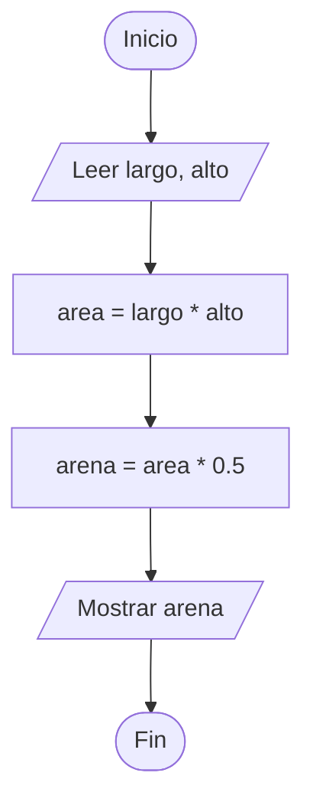
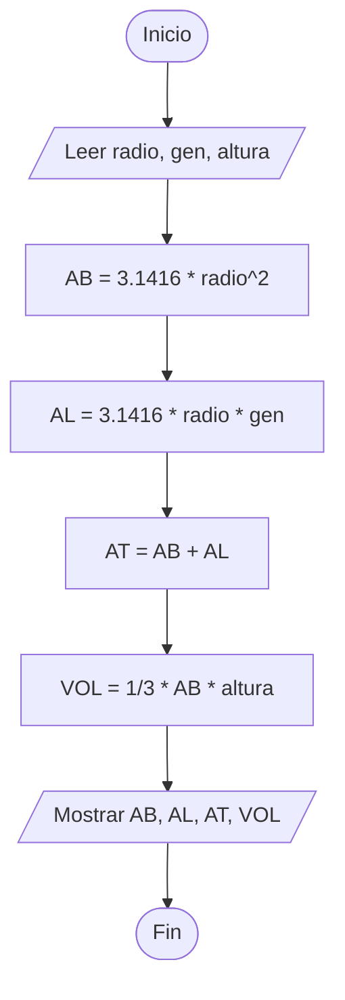
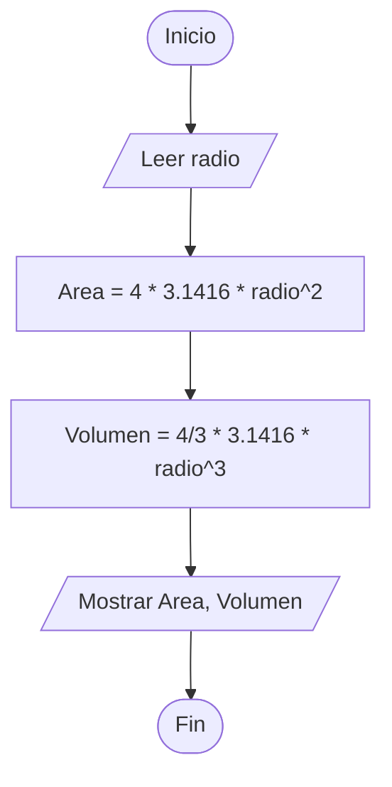
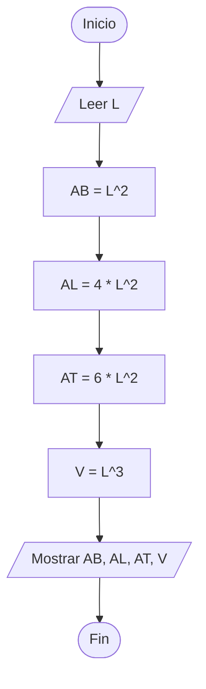
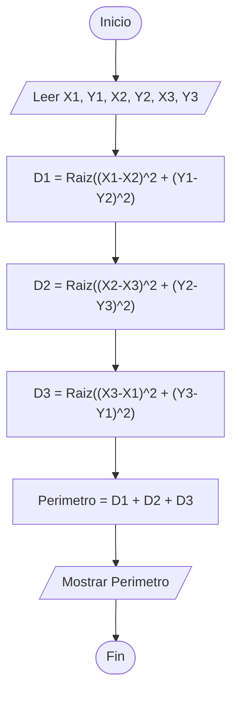

# Ejercicios secuenciales

## Ejercicio 1: 
Un constructor sabe que necesita 0.5 metros cúbicos de arena por metro cuadrado de revoque a realizar. Escriba un algoritmo que le permita obtener la cantidad de arena necesaria para revocar una pared cualquiera, según sus medidas (largo y alto) expresadas en metros.

### Análisis

- **Entrada:** `largo` y `alto` de la pared (en metros).
    
- **Proceso:** * Calcular el área de la pared: $\text{area} = \text{largo} \times \text{alto}$
    
    - Calcular la arena necesaria (sabiendo que se requieren $0.5\text{ m}^3$ por $\text{m}^2$): $\text{arena} = \text{area} \times 0.5$
        
- **Salida:** `arena`
    

### Pseudocódigo

```Plaintext
Entrada
    Leer: largo, alto
Proceso
    area = largo * alto
    arena = area * 0.5
Salida
    Mostrar: arena
```

### Diagrama de Flujo



### Prueba de Escritorio

| **largo** | **alto** | **area** | **arena** | **Mostrar: arena** |
| --------- | -------- | -------- | --------- | ------------------ |
| 4         | 3        | 12       | 6.0       | **6.0**            |
| 5         | 2        | 10       | 5.0       | **5.0**            |

### Código JAVA

```Java
import java.util.Scanner;

class Ejercicio01 {

    public static void main(String[] args) {
        Scanner leer = new Scanner(System.in);

        System.out.println("Ingrese el largo de la pared en metros: ");
        int largo = leer.nextInt();
        System.out.println("Ingrese el alto de la pared en metros: ");
        int alto = leer.nextInt();

        double area = largo * alto;
        double arena = area * 0.5;

        System.out.println(
            "La cantidad de arena necesaria para revocar la pared es: " +
                arena +
                " metros cúbicos."
        );

        leer.close();
    }
}
```


## Ejercicio 2:
Construya el algoritmo tal que, dado el radio, la generatriz y la altura de un cono, calcule e imprima el area de la base, el area lateral, el area total y su volumen.

*Consideraciones:*
- El area de la base se calcula aplicando la siguiente formula: $AB=\pi\times\text{RADIO}^2$ 
- El area lateral se calcula: $AL=\pi\times\text{RADIO}\times\text{GENERATRIZ}$
- El area total se calcula como: $AT=AB+A$
- El volumen se calcula de la siguiente forma: $VOL=\frac{1}{3}\times\text{AB}\times\text{ALTURA}$

### Análisis

- **Entrada:** `radio`, `generatriz`, `altura`
    
- **Proceso:** * $AB = \pi \times \text{radio}^2$
    
    - $AL = \pi \times \text{radio} \times \text{generatriz}$
        
    - $AT = AB + AL$
        
    - $VOL = (1/3) \times AB \times \text{altura}$
        
- **Salida:** `AB`, `AL`, `AT`, `VOL`
    

### Pseudocódigo

```Plaintext
Entrada
    Leer: radio, generatriz, altura
Proceso
    AB = 3.1416 * (radio^2)
    AL = 3.1416 * radio * generatriz
    AT = AB + AL
    VOL = (1/3) * AB * altura
Salida
    Mostrar: AB, AL, AT, VOL
```

### Diagrama de Flujo


### Prueba de Escritorio (Usando $\pi \approx 3.1416$)

| **radio** | **generatriz** | **altura** | **AB** | **AL** | **AT** | **VOL** |
| --------- | -------------- | ---------- | ------ | ------ | ------ | ------- |
| 3         | 5              | 4          | 28.27  | 47.12  | 75.39  | 37.70   |

### Código JAVA
```Java
import java.util.Scanner;

class Ejercicio02 {

    public static void main(String[] args) {
        Scanner leer = new Scanner(System.in);

        System.out.println("Ingrese el radio: ");
        int radio = leer.nextInt();
        System.out.println("Ingrese la generatriz: ");
        int generatriz = leer.nextInt();
        System.out.println("Ingrese la altura: ");
        int altura = leer.nextInt();

        double AB = Math.PI * Math.pow(radio, 2);
        double AL = Math.PI * radio * generatriz;
        double AT = AB + AL;
        double VOL = (1.0 / 3.0) * AB * altura;

        System.out.println("El area de la base es: " + AB);
        System.out.println("El area lateral es: " + AL);
        System.out.println("El area total es: " + AT);
        System.out.println("El volumen es: " + VOL);

        leer.close();
    }
}
```


## Ejercicio 3:
Construya un algoritmo tal que, dado el radio de una esfera, calcule e imprima el area y su volumen.

*Consideraciones:*
- El area de una esfera la calculamos de esta forma: $Area=4\cdot\pi\cdot\text{(radio)}^2$
- El volumen como: $Volumen=\frac{4}{3}\cdot\pi\cdot\text{radio}^3$

### Análisis

- **Entrada:** `radio`
    
- **Proceso:**
    
    - $\text{Area} = 4 \times \pi \times \text{radio}^2$
        
    - $\text{Volumen} = (4/3) \times \pi \times \text{radio}^3$
        
- **Salida:** `Area`, `Volumen`
    

### Pseudocódigo

```Plaintext
Entrada
    Leer: radio
Proceso
    Area = 4 * 3.1416 * (radio^2)
    Volumen = (4/3) * 3.1416 * (radio^3)
Salida
    Mostrar: Area, Volumen
```

### Diagrama de Flujo



### Prueba de Escritorio

|**radio**|**Area**|**Volumen**|**Mostrar**|
|---|---|---|---|
|3|113.10|113.10|**Area: 113.10, Vol: 113.10**|

### Codigo JAVA
```Java
import java.util.Scanner;

class Ejercicio03 {

    public static void main(String[] args) {
        Scanner leer = new Scanner(System.in);

        System.out.println("Ingrese el radio de la esfera: ");
        int radio = leer.nextInt();

        double area = 4 * Math.PI * Math.pow(radio, 2);
        double volumen = (4.0 / 3.0) * Math.PI * Math.pow(radio, 3);

        System.out.println("El area de la esfera es: " + area);
        System.out.println("El volumen de la esfera es: " + volumen);

        leer.close();
    }
}
```


## Ejercicio 4:
Construya el algoritmo tal que, dado como dato el lado de un hexaedro o cubo, calcule el area base, el area lateral, el area total y volumen.

*Consideraciones:*
- Para calcular el area de la base aplicamos la siguiente formula: $AB=L^2$
- Para calcular el area lateral hacemos: $AL=4 \times L^2$
- Para calcular el area total hacemos: $AT=6 \times L^2$
- Para calcular el volumen hacemos: $V=L \times 3$

### Análisis

- **Entrada:** `L` (Lado del cubo)
    
- **Proceso:**
    
    - $AB = L^2$
        
    - $AL = 4 \times L^2$
        
    - $AT = 6 \times L^2$
        
    - $V = L^3$
        
- **Salida:** `AB`, `AL`, `AT`, `V`
    

### Pseudocódigo

```Plaintext
Entrada
    Leer: L
Proceso
    AB = L^2
    AL = 4 * (L^2)
    AT = 6 * (L^2)
    V = L^3
Salida
    Mostrar: AB, AL, AT, V
```

### Diagrama de Flujo



### Prueba de Escritorio

|**L**|**AB**|**AL**|**AT**|**V**|
|---|---|---|---|---|
|2|4|16|24|8|
|3|9|36|54|27|
### Código JAVA
```Java
import java.util.Scanner;

class Ejercicio04 {

    public static void main(String[] args) {
        Scanner leer = new Scanner(System.in);

        System.out.println("Ingrese el lado del hexaedro o cubo: ");
        int L = leer.nextInt();

        double AB = Math.pow(L, 2);
        double AL = 4 * Math.pow(L, 2);
        double AT = 6 * Math.pow(L, 2);
        double V = Math.pow(L, 3);

        System.out.println("El area de la base es: " + AB);
        System.out.println("El area lateral es: " + AL);
        System.out.println("El area total es: " + AT);
        System.out.println("El volumen es: " + V);

        leer.close();
    }
}
```


## Ejercicio 5:
Construya el algoritmo tal que, dadas las coordenadas de los puntos $P_1$ , $P_2$  y $P_3$ que corresponden a los vertices de un triangulo, calcule su perímetro.

Donde:

- $X_1$  y $Y_1$  representan las coordenadas en el eje de las $X$  y las $Y$ , del punto $P_1$.
- $X_2$  y $Y_2$  expresan las coordenadas en el eje de las $X$  y las $Y$ , del punto $P_2$.
- $X_3$  y $Y_3$  representan las coordenadas en el eje de las $X$  y las $Y$ , del punto $P_3$.

*Consideraciones:*

Para calcular la distancia entre dos puntos $P_1$  y $P_2$  hacemos:
$$D=\sqrt{(X_1-X_2)^2+(Y_1-Y_2)^2}$$


### Análisis

- **Entrada:** Coordenadas de los 3 vértices: `X1`, `Y1`, `X2`, `Y2`, `X3`, `Y3`
    
- **Proceso:**
    
    - Distancia lado 1 ($P_1$ a $P_2$): $D1 = \sqrt{(X1 - X2)^2 + (Y1 - Y2)^2}$
        
    - Distancia lado 2 ($P_2$ a $P_3$): $D2 = \sqrt{(X2 - X3)^2 + (Y2 - Y3)^2}$
        
    - Distancia lado 3 ($P_3$ a $P_1$): $D3 = \sqrt{(X3 - X1)^2 + (Y3 - Y1)^2}$
        
    - Perímetro total: $\text{Perimetro} = D1 + D2 + D3$
        
- **Salida:** `Perimetro`
    

### Pseudocódigo

```Plaintext
Entrada
    Leer: X1, Y1, X2, Y2, X3, Y3
Proceso
    D1 = Raiz((X1 - X2)^2 + (Y1 - Y2)^2)
    D2 = Raiz((X2 - X3)^2 + (Y2 - Y3)^2)
    D3 = Raiz((X3 - X1)^2 + (Y3 - Y1)^2)
    Perimetro = D1 + D2 + D3
Salida
    Mostrar: Perimetro
```

### Diagrama de Flujo



### Prueba de Escritorio

| **X1** | **Y1** | **X2** | **Y2** | **X3** | **Y3** | **D1** | **D2** | **D3** | **Perimetro** |
| ------ | ------ | ------ | ------ | ------ | ------ | ------ | ------ | ------ | ------------- |
| 0      | 0      | 3      | 0      | 0      | 4      | 3.0    | 5.0    | 4.0    | **12.0**      |

### Código JAVA

```Java
import java.util.Scanner;

class Ejercicio05 {

    public static void main(String[] args) {
        Scanner leer = new Scanner(System.in);

        double X1, Y1, X2, Y2, X3, Y3;

        System.out.println("Ingrese el valor de X1: ");
        X1 = leer.nextDouble();
        System.out.println("Ingrese el valor de Y1: ");
        Y1 = leer.nextDouble();
        System.out.println("Ingrese el valor de X2: ");
        X2 = leer.nextDouble();
        System.out.println("Ingrese el valor de Y2: ");
        Y2 = leer.nextDouble();
        System.out.println("Ingrese el valor de X3: ");
        X3 = leer.nextDouble();
        System.out.println("Ingrese el valor de Y3: ");
        Y3 = leer.nextDouble();

        double D1 = Math.sqrt(Math.pow(X1 - X2, 2) + Math.pow(Y1 - Y2, 2));
        double D2 = Math.sqrt(Math.pow(X2 - X3, 2) + Math.pow(Y2 - Y3, 2));
        double D3 = Math.sqrt(Math.pow(X3 - X1, 2) + Math.pow(Y3 - Y1, 2));
        double perimetro = D1 + D2 + D3;

        System.out.println(
            "El perímetro del triángulo formado por los puntos es: " + perimetro
        );

        leer.close();
    }
}
```
