# Practica 1

# Sección I

## 1. FACTURA DE AGUA POTABLE DOMICILIARIA
Una empresa de agua calcula el monto final de una factura según el consumo mensual y la edad del titular.

**Entradas:**

- consumo mensual en m³
    
- edad del titular
    

**Reglas:**

- Si el consumo es menor o igual a 30 m³: tarifa = 2.50 Bs por m³
    
- En caso contrario: tarifa = 4.20 Bs por m³
    
- Si la edad es mayor o igual a 65 años: descuento de 15 Bs sobre el total.
    
- Caso contrario: no existe descuento.
    
- Si el consumo es negativo, mostrar error.
    

**Salida:**

- Monto final a pagar.
    

### Análisis

- **Entradas:** `consumo` (entero o decimal), `edad` (entero).
    
- **Procesos:** 1. Validar que el consumo no sea negativo.
    
    2. Determinar la tarifa por m³ según el consumo.
    
    3. Calcular el subtotal (consumo * tarifa).
    
    4. Aplicar un descuento fijo de 15 Bs si la edad es >= 65.
    
    5. Restar el descuento al subtotal para obtener el total.
    
- **Salidas:** `montoFinal` (decimal) o un mensaje de error.
    

### Pseudocódigo

```Plaintext
INICIO
    LEER consumo
    LEER edad
    SI consumo < 0 ENTONCES
        IMPRIMIR "Error: El consumo no puede ser negativo"
    SINO
        SI consumo <= 30 ENTONCES
            tarifa = 2.50
        SINO
            tarifa = 4.20
        FIN SI
        
        subtotal = consumo * tarifa
        
        SI edad >= 65 ENTONCES
            descuento = 15
        SINO
            descuento = 0
        FIN SI
        
        montoFinal = subtotal - descuento
        IMPRIMIR montoFinal
    FIN SI
FIN
```

### Diagrama de Flujo

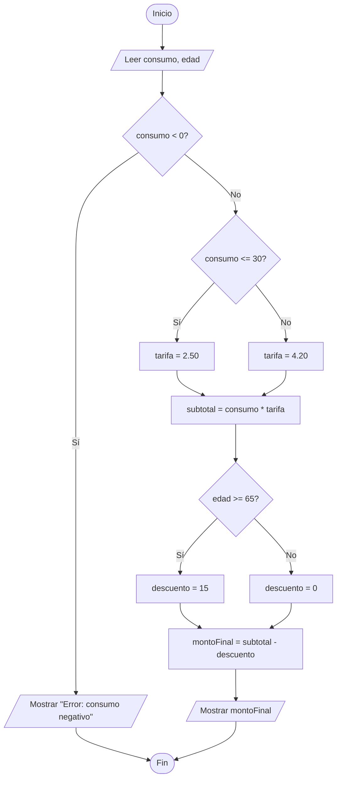

### Prueba de Escritorio

|**Paso**|**consumo**|**edad**|**tarifa**|**subtotal**|**descuento**|**montoFinal**|**Salida Pantalla**|
|---|---|---|---|---|---|---|---|
|1|40|70|-|-|-|-|-|
|2|40|70|4.20|-|-|-|-|
|3|40|70|4.20|168.0|-|-|-|
|4|40|70|4.20|168.0|15.0|-|-|
|5|40|70|4.20|168.0|15.0|153.0|-|
|6|40|70|4.20|168.0|15.0|153.0|"Monto final a pagar: 153.0 Bs"|

### Código Java

```Java
import java.util.Scanner;

public class FacturaAgua {
    public static void main(String[] args) {
        Scanner teclado = new Scanner(System.in);
        
        System.out.print("Ingrese el consumo mensual en m3: ");
        double consumo = teclado.nextDouble();
        
        System.out.print("Ingrese la edad del titular: ");
        int edad = teclado.nextInt();
        
        if (consumo < 0) {
            System.out.println("Error: El consumo no puede ser negativo.");
        } else {
            double tarifa;
            if (consumo <= 30) {
                tarifa = 2.50;
            } else {
                tarifa = 4.20;
            }
            
            double subtotal = consumo * tarifa;
            double descuento;
            
            if (edad >= 65) {
                descuento = 15.0;
            } else {
                descuento = 0.0;
            }
            
            double montoFinal = subtotal - descuento;
            System.out.println("Monto final a pagar: " + montoFinal + " Bs");
        }
        
        teclado.close();
    }
}
```

## 3. COSTO DE ESTACIONAMIENTO VEHICULAR
Un estacionamiento calcula el monto a pagar según las horas de permanencia.

**Entradas:**

- horas estacionadas
    
- tipo de cliente (normal o frecuente)
    

**Reglas:**

- Si permanece hasta 5 horas: tarifa = 8 Bs por hora
    
- En caso contrario: tarifa = 6 Bs por hora
    
- Si es cliente frecuente: descuento del 10%.
    
- Caso contrario: sin descuento.
    
- Si las horas son negativas, mostrar error.
    

**Salida:**

- Total a pagar.
    

### Análisis

- **Entradas:** `horas` (entero), `tipoCliente` (texto).
    
- **Procesos:**
    
    1. Validar horas negativas.
        
    2. Calcular subtotal multiplicando horas por tarifa (8 si horas <= 5, sino 6).
        
    3. Calcular descuento del 10% (subtotal * 0.10) si el cliente es "frecuente".
        
    4. Restar descuento al subtotal para obtener el total a pagar.
        
- **Salidas:** `totalPagar` (decimal) o mensaje de error.
    

### Pseudocódigo

```Plaintext
INICIO
    LEER horas
    LEER tipoCliente
    SI horas < 0 ENTONCES
        IMPRIMIR "Error: Las horas no pueden ser negativas"
    SINO
        SI horas <= 5 ENTONCES
            tarifa = 8
        SINO
            tarifa = 6
        FIN SI
        
        subtotal = horas * tarifa
        
        SI tipoCliente == "frecuente" ENTONCES
            descuento = subtotal * 0.10
        SINO
            descuento = 0
        FIN SI
        
        totalPagar = subtotal - descuento
        IMPRIMIR totalPagar
    FIN SI
FIN
```

### Diagrama de Flujo

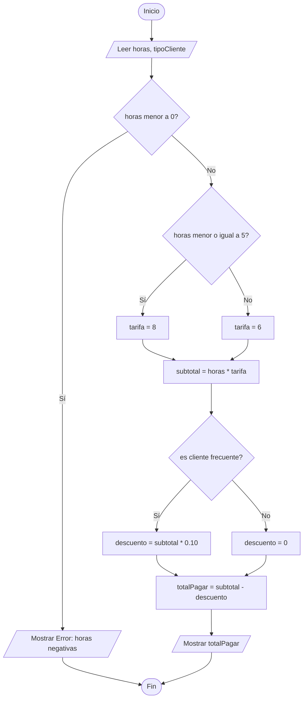

### Prueba de Escritorio

|**Paso**|**horas**|**tipoCliente**|**tarifa**|**subtotal**|**descuento**|**totalPagar**|**Salida Pantalla**|
|---|---|---|---|---|---|---|---|
|1|8|"frecuente"|-|-|-|-|-|
|2|8|"frecuente"|6|-|-|-|-|
|3|8|"frecuente"|6|48.0|-|-|-|
|4|8|"frecuente"|6|48.0|4.8|-|-|
|5|8|"frecuente"|6|48.0|4.8|43.2|-|
|6|8|"frecuente"|6|48.0|4.8|43.2|"Total a pagar: 43.2 Bs"|

### Código Java

```Java
import java.util.Scanner;

public class Estacionamiento {
    public static void main(String[] args) {
        Scanner teclado = new Scanner(System.in);
        
        System.out.print("Ingrese las horas estacionadas: ");
        int horas = teclado.nextInt();
        
        System.out.print("Ingrese el tipo de cliente (normal o frecuente): ");
        String tipoCliente = teclado.next();
        
        if (horas < 0) {
            System.out.println("Error: Las horas no pueden ser negativas.");
        } else {
            double tarifa;
            if (horas <= 5) {
                tarifa = 8.0;
            } else {
                tarifa = 6.0;
            }
            
            double subtotal = horas * tarifa;
            double descuento;
            
            if (tipoCliente.equalsIgnoreCase("frecuente")) {
                descuento = subtotal * 0.10;
            } else {
                descuento = 0.0;
            }
            
            double totalPagar = subtotal - descuento;
            System.out.println("Total a pagar: " + totalPagar + " Bs");
        }
        
        teclado.close();
    }
}
```

## 5. COBRO DE PEAJE INTERDEPARTAMENTAL
Una concesionaria calcula el costo del peaje según el peso del vehículo.

**Entradas:**

- peso del vehículo en toneladas
    
- posee pase frecuente (sí o no)
    

**Reglas:**

- Si el peso es menor o igual a 4 toneladas: peaje = 25 Bs
    
- En caso contrario: peaje = 45 Bs
    
- Si posee pase frecuente: descuento de 5 Bs.
    
- Caso contrario: sin descuento.
    
- Si el peso es menor o igual a cero, mostrar error.
    

**Salida:**

- Monto a pagar.
    

### Análisis

- **Entradas:** `peso` (decimal), `paseFrecuente` (texto).
    
- **Procesos:**
    
    1. Validar que el peso sea mayor a cero.
        
    2. Determinar costo del peaje según peso (25 o 45).
        
    3. Aplicar descuento fijo de 5 Bs si tiene pase frecuente.
        
    4. Restar el descuento al costo base del peaje.
        
- **Salidas:** `montoPagar` (decimal) o mensaje de error.
    

### Pseudocódigo

```Plaintext
INICIO
    LEER peso
    LEER paseFrecuente
    SI peso <= 0 ENTONCES
        IMPRIMIR "Error: El peso debe ser mayor a cero"
    SINO
        SI peso <= 4 ENTONCES
            peaje = 25
        SINO
            peaje = 45
        FIN SI
        
        SI paseFrecuente == "si" ENTONCES
            descuento = 5
        SINO
            descuento = 0
        FIN SI
        
        montoPagar = peaje - descuento
        IMPRIMIR montoPagar
    FIN SI
FIN
```

### Diagrama de Flujo

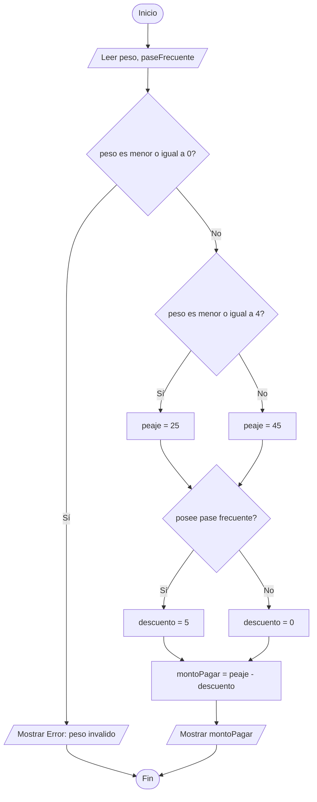

### Prueba de Escritorio

|**Paso**|**peso**|**paseFrecuente**|**peaje**|**descuento**|**montoPagar**|**Salida Pantalla**|
|---|---|---|---|---|---|---|
|1|6.0|"si"|-|-|-|-|
|2|6.0|"si"|45.0|-|-|-|
|3|6.0|"si"|45.0|5.0|-|-|
|4|6.0|"si"|45.0|5.0|40.0|-|
|5|6.0|"si"|45.0|5.0|40.0|"Monto final a pagar: 40.0 Bs"|

### Código Java

```Java
import java.util.Scanner;

public class PeajeInterdepartamental {
    public static void main(String[] args) {
        Scanner teclado = new Scanner(System.in);
        
        System.out.print("Ingrese el peso del vehículo en toneladas: ");
        double peso = teclado.nextDouble();
        
        System.out.print("¿Posee pase frecuente? (si o no): ");
        String paseFrecuente = teclado.next();
        
        if (peso <= 0) {
            System.out.println("Error: El peso debe ser mayor a cero.");
        } else {
            double peaje;
            if (peso <= 4) {
                peaje = 25.0;
            } else {
                peaje = 45.0;
            }
            
            double descuento;
            if (paseFrecuente.equalsIgnoreCase("si")) {
                descuento = 5.0;
            } else {
                descuento = 0.0;
            }
            
            double montoPagar = peaje - descuento;
            System.out.println("Monto final a pagar: " + montoPagar + " Bs");
        }
        
        teclado.close();
    }
}
```

## 6. COSTO DE IMPRESIÓN DIGITAL
Una imprenta calcula el costo de impresión según la cantidad de páginas solicitadas.

**Entradas:**

- número de páginas
    
- tipo de cliente (empresa o particular)
    

**Reglas:**

- Si imprime hasta 200 páginas: costo = 0.60 Bs por página
    
- En caso contrario: costo = 0.45 Bs por página
    
- Si el cliente es empresa: descuento del 8%.
    
- Caso contrario: sin descuento.
    
- Si la cantidad de páginas es negativa, mostrar error.
    

**Salida:**

- Costo total.
    

### Análisis

- **Entradas:** `paginas` (entero), `tipoCliente` (texto).
    
- **Procesos:**
    
    1. Validar que la cantidad de páginas no sea negativa.
        
    2. Calcular subtotal de acuerdo al número de páginas (0.60 hasta 200, si no 0.45).
        
    3. Calcular un descuento del 8% (subtotal * 0.08) si el cliente es "empresa".
        
    4. Restar descuento al subtotal.
        
- **Salidas:** `costoTotal` (decimal) o mensaje de error.
    

### Pseudocódigo

```Plaintext
INICIO
    LEER paginas
    LEER tipoCliente
    SI paginas < 0 ENTONCES
        IMPRIMIR "Error: La cantidad de páginas no puede ser negativa"
    SINO
        SI paginas <= 200 ENTONCES
            tarifa = 0.60
        SINO
            tarifa = 0.45
        FIN SI
        
        subtotal = paginas * tarifa
        
        SI tipoCliente == "empresa" ENTONCES
            descuento = subtotal * 0.08
        SINO
            descuento = 0
        FIN SI
        
        costoTotal = subtotal - descuento
        IMPRIMIR costoTotal
    FIN SI
FIN
```

### Diagrama de Flujo

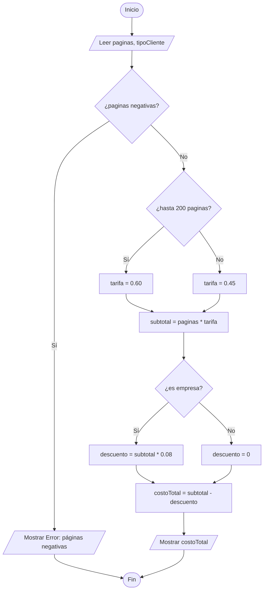

### Prueba de Escritorio

|**Paso**|**paginas**|**tipoCliente**|**tarifa**|**subtotal**|**descuento**|**costoTotal**|**Salida Pantalla**|
|---|---|---|---|---|---|---|---|
|1|300|"empresa"|-|-|-|-|-|
|2|300|"empresa"|0.45|-|-|-|-|
|3|300|"empresa"|0.45|135.0|-|-|-|
|4|300|"empresa"|0.45|135.0|10.8|-|-|
|5|300|"empresa"|0.45|135.0|10.8|124.2|-|
|6|300|"empresa"|0.45|135.0|10.8|124.2|"Costo total: 124.2 Bs"|

### Código Java

```Java
import java.util.Scanner;

public class ImpresionDigital {
    public static void main(String[] args) {
        Scanner teclado = new Scanner(System.in);
        
        System.out.print("Ingrese el número de páginas: ");
        int paginas = teclado.nextInt();
        
        System.out.print("Ingrese el tipo de cliente (empresa o particular): ");
        String tipoCliente = teclado.next();
        
        if (paginas < 0) {
            System.out.println("Error: La cantidad de páginas no puede ser negativa.");
        } else {
            double tarifa;
            if (paginas <= 200) {
                tarifa = 0.60;
            } else {
                tarifa = 0.45;
            }
            
            double subtotal = paginas * tarifa;
            double descuento;
            
            if (tipoCliente.equalsIgnoreCase("empresa")) {
                descuento = subtotal * 0.08;
            } else {
                descuento = 0.0;
            }
            
            double costoTotal = subtotal - descuento;
            System.out.println("Costo total: " + costoTotal + " Bs");
        }
        
        teclado.close();
    }
}
```


# Sección II
## 1. FACTURA DE GAS DOMICILIARIO
Una empresa distribuidora de gas calcula el monto a pagar según el consumo mensual.

**Entradas:**

- consumo en m³
    
- edad del titular
    

**Reglas:**

- Hasta 50 m³ → 1.80 Bs por m³
    
- De 51 a 150 m³ → 2.50 Bs por m³
    
- Más de 150 m³ → 3.20 Bs por m³
    
- Si la edad es mayor o igual a 65 años: descuento de 8%
    
- Si el consumo es negativo: mostrar error
    

**Salida:**

- Monto final
    

### Análisis

- **Datos requeridos:** Se necesita ingresar el volumen de gas consumido (valor numérico) y la edad del cliente (entero).
    
- **Reglas de negocio:** 1. La validación principal es asegurar que el consumo no sea un valor negativo.
    
    2. El costo por metro cúbico escala en tres niveles dependiendo del volumen total consumido (selección múltiple).
    
    3. Existe un beneficio de descuento porcentual (8%) aplicable al subtotal únicamente para personas de la tercera edad (65 años o más).
    
- **Cálculo y resultado:** Se debe calcular el subtotal base (consumo multiplicado por la tarifa correspondiente al nivel), restarle el descuento si aplica, y emitir el valor final en formato de moneda.
    

### Pseudocódigo

```Plaintext
INICIO
    LEER consumo
    LEER edad
    
    SI consumo < 0 ENTONCES
        IMPRIMIR "Error: El consumo no puede ser negativo"
    SINO
        SI consumo <= 50 ENTONCES
            tarifa = 1.80
        SINO SI consumo <= 150 ENTONCES
            tarifa = 2.50
        SINO
            tarifa = 3.20
        FIN SI
        
        subtotal = consumo * tarifa
        
        SI edad >= 65 ENTONCES
            descuento = subtotal * 0.08
        SINO
            descuento = 0
        FIN SI
        
        montoFinal = subtotal - descuento
        IMPRIMIR montoFinal
    FIN SI
FIN
```

### Diagrama de Flujo

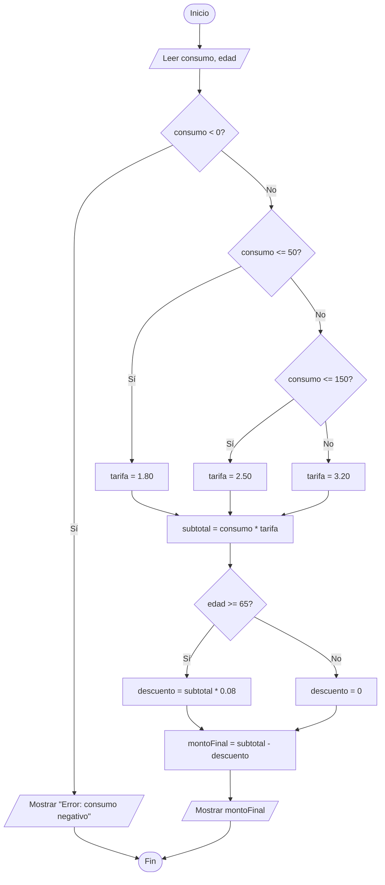

### Prueba de Escritorio

|**Paso**|**consumo**|**edad**|**tarifa**|**subtotal**|**descuento**|**montoFinal**|**Salida Pantalla**|
|---|---|---|---|---|---|---|---|
|1|120.0|70|-|-|-|-|-|
|2|120.0|70|2.50|-|-|-|-|
|3|120.0|70|2.50|300.0|-|-|-|
|4|120.0|70|2.50|300.0|24.0|-|-|
|5|120.0|70|2.50|300.0|24.0|276.0|-|
|6|120.0|70|2.50|300.0|24.0|276.0|"Monto final: 276.0 Bs"|

### Código Java

```Java
import java.util.Scanner;

public class FacturaGas {
    public static void main(String[] args) {
        Scanner teclado = new Scanner(System.in);
        
        System.out.print("Ingrese el consumo en m3: ");
        double consumo = teclado.nextDouble();
        
        System.out.print("Ingrese la edad del titular: ");
        int edad = teclado.nextInt();
        
        if (consumo < 0) {
            System.out.println("Error: El consumo no puede ser negativo.");
        } else {
            double tarifa;
            
            if (consumo <= 50) {
                tarifa = 1.80;
            } else if (consumo <= 150) {
                tarifa = 2.50;
            } else {
                tarifa = 3.20;
            }
            
            double subtotal = consumo * tarifa;
            double descuento;
            
            if (edad >= 65) {
                descuento = subtotal * 0.08;
            } else {
                descuento = 0.0;
            }
            
            double montoFinal = subtotal - descuento;
            System.out.println("Monto final: " + montoFinal + " Bs");
        }
        
        teclado.close();
    }
}
```

## 2. TARIFA DE ESTACIONAMIENTO AEROPORTUARIO
Un aeropuerto cobra el estacionamiento según el tiempo de permanencia.

**Entradas:**

- horas estacionadas
    
- tipo de vehículo
    

**Reglas:**

- Hasta 3 horas → 10 Bs/hora
    
- De 4 a 10 horas → 8 Bs/hora
    
- Más de 10 horas → 6 Bs/hora
    
- Si el vehículo es motocicleta: descuento de 20%
    
- Si las horas son negativas: mostrar error
    

**Salida:**

- Total a pagar
    

### Análisis

- **Datos requeridos:** Tiempo de permanencia en horas (entero) y la clasificación del vehículo ingresado (texto).
    
- **Reglas de negocio:** 1. Filtrar registros inválidos donde el tiempo sea menor a cero.
    
    2. Determinar la tarifa horaria que disminuye conforme aumenta el tiempo de estadía, categorizada en tres rangos de tiempo.
    
    3. Aplicar un incentivo (20% de reducción sobre el costo base) exclusivo para usuarios de motocicletas.
    
- **Cálculo y resultado:** Multiplicar las horas por la tarifa correspondiente al bloque de tiempo, aplicar la reducción porcentual si el vehículo cumple la condición, y mostrar el costo final.
    

### Pseudocódigo

```Plaintext
INICIO
    LEER horas
    LEER vehiculo
    
    SI horas < 0 ENTONCES
        IMPRIMIR "Error: Las horas no pueden ser negativas"
    SINO
        SI horas <= 3 ENTONCES
            tarifa = 10
        SINO SI horas <= 10 ENTONCES
            tarifa = 8
        SINO
            tarifa = 6
        FIN SI
        
        subtotal = horas * tarifa
        
        SI vehiculo == "motocicleta" ENTONCES
            descuento = subtotal * 0.20
        SINO
            descuento = 0
        FIN SI
        
        totalPagar = subtotal - descuento
        IMPRIMIR totalPagar
    FIN SI
FIN
```

### Diagrama de Flujo

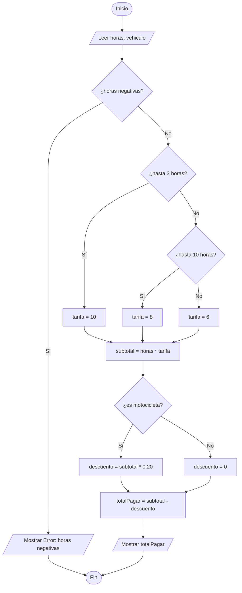

### Prueba de Escritorio

| **Paso** | **horas** | **vehiculo**  | **tarifa** | **subtotal** | **descuento** | **totalPagar** | **Salida Pantalla**      |
| -------- | --------- | ------------- | ---------- | ------------ | ------------- | -------------- | ------------------------ |
| 1        | 12        | "motocicleta" | -          | -            | -             | -              | -                        |
| 2        | 12        | "motocicleta" | 6          | -            | -             | -              | -                        |
| 3        | 12        | "motocicleta" | 6          | 72.0         | -             | -              | -                        |
| 4        | 12        | "motocicleta" | 6          | 72.0         | 14.4          | -              | -                        |
| 5        | 12        | "motocicleta" | 6          | 72.0         | 14.4          | 57.6           | -                        |
| 6        | 12        | "motocicleta" | 6          | 72.0         | 14.4          | 57.6           | "Total a pagar: 57.6 Bs" |
|          |           |               |            |              |               |                |                          |

### Código Java

```Java
import java.util.Scanner;

public class EstacionamientoAeropuerto {
    public static void main(String[] args) {
        Scanner teclado = new Scanner(System.in);
        
        System.out.print("Ingrese las horas estacionadas: ");
        int horas = teclado.nextInt();
        
        System.out.print("Ingrese el tipo de vehículo: ");
        String vehiculo = teclado.next();
        
        if (horas < 0) {
            System.out.println("Error: Las horas no pueden ser negativas.");
        } else {
            int tarifa;
            
            if (horas <= 3) {
                tarifa = 10;
            } else if (horas <= 10) {
                tarifa = 8;
            } else {
                tarifa = 6;
            }
            
            double subtotal = horas * tarifa;
            double descuento;
            
            if (vehiculo.equalsIgnoreCase("motocicleta")) {
                descuento = subtotal * 0.20;
            } else {
                descuento = 0.0;
            }
            
            double totalPagar = subtotal - descuento;
            System.out.println("Total a pagar: " + totalPagar + " Bs");
        }
        
        teclado.close();
    }
}
```


## 4. COSTO DE ENVÍO DE PAQUETERÍA
Una empresa de mensajería calcula el costo según el peso del paquete.

**Entradas:**

- peso en kg
    
- destino (nacional o internacional)
    

**Reglas:**

- Hasta 5 kg → 15 Bs/kg
    
- De 6 a 20 kg → 12 Bs/kg
    
- Más de 20 kg → 10 Bs/kg
    
- Si el destino es internacional: recargo del 25%
    
- Si el peso es menor o igual a 0: error
    

**Salida:**

- Costo total
    

### Análisis

- **Datos requeridos:** El peso físico del paquete (valor numérico decimal) y el tipo de destino de la entrega (texto).
    
- **Reglas de negocio:**
    
    1. Asegurar la integridad de los datos verificando que el peso ingresado sea mayor a cero.
        
    2. Determinar la tarifa de envío por kilogramo, la cual se reduce progresivamente en función del volumen (selección múltiple de rangos).
        
    3. Condición especial: Los envíos fuera del país sufren un **recargo** (es decir, un aumento, no un descuento) del 25% sobre el costo base.
        
- **Cálculo y resultado:** Multiplicar el peso por la tarifa obtenida para hallar el subtotal, calcular el monto del recargo si aplica, y finalmente sumar este recargo al subtotal para obtener el costo total a pagar.
    

### Pseudocódigo

```Plaintext
INICIO
    LEER peso
    LEER destino
    
    SI peso <= 0 ENTONCES
        IMPRIMIR "Error: El peso debe ser mayor a cero"
    SINO
        SI peso <= 5 ENTONCES
            tarifa = 15
        SINO SI peso <= 20 ENTONCES
            tarifa = 12
        SINO
            tarifa = 10
        FIN SI
        
        subtotal = peso * tarifa
        
        SI destino == "internacional" ENTONCES
            recargo = subtotal * 0.25
        SINO
            recargo = 0
        FIN SI
        
        costoTotal = subtotal + recargo
        IMPRIMIR costoTotal
    FIN SI
FIN
```

### Diagrama de Flujo

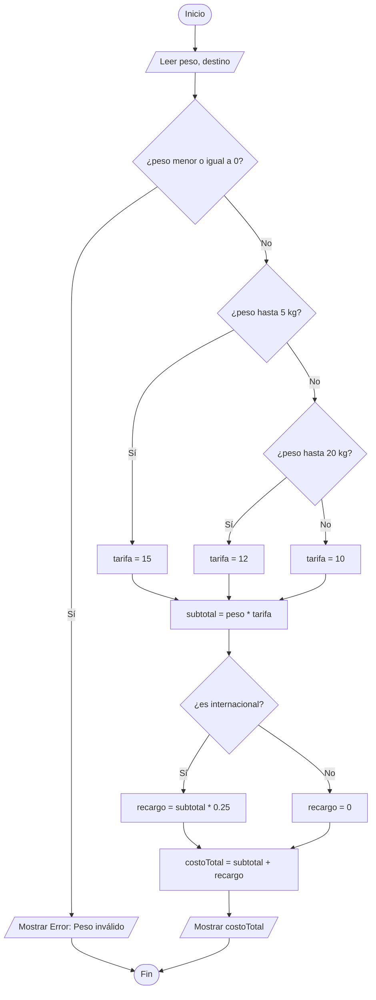

### Prueba de Escritorio

|**Paso**|**peso**|**destino**|**tarifa**|**subtotal**|**recargo**|**costoTotal**|**Salida Pantalla**|
|---|---|---|---|---|---|---|---|
|1|12.0|"internacional"|-|-|-|-|-|
|2|12.0|"internacional"|12.0|-|-|-|-|
|3|12.0|"internacional"|12.0|144.0|-|-|-|
|4|12.0|"internacional"|12.0|144.0|36.0|-|-|
|5|12.0|"internacional"|12.0|144.0|36.0|180.0|-|
|6|12.0|"internacional"|12.0|144.0|36.0|180.0|"Costo total: 180.0 Bs"|

### Código Java

```Java
import java.util.Scanner;

public class EnvioPaqueteria {
    public static void main(String[] args) {
        Scanner teclado = new Scanner(System.in);
        
        System.out.print("Ingrese el peso del paquete en kg: ");
        double peso = teclado.nextDouble();
        
        System.out.print("Ingrese el destino (nacional o internacional): ");
        String destino = teclado.next();
        
        if (peso <= 0) {
            System.out.println("Error: El peso debe ser mayor a cero.");
        } else {
            double tarifa;
            
            if (peso <= 5) {
                tarifa = 15.0;
            } else if (peso <= 20) {
                tarifa = 12.0;
            } else {
                tarifa = 10.0;
            }
            
            double subtotal = peso * tarifa;
            double recargo;
            
            if (destino.equalsIgnoreCase("internacional")) {
                recargo = subtotal * 0.25;
            } else {
                recargo = 0.0;
            }
            
            double costoTotal = subtotal + recargo;
            System.out.println("Costo total: " + costoTotal + " Bs");
        }
        
        teclado.close();
    }
}
```

## 5. PAGO DE MATRÍCULA UNIVERSITARIA
Una universidad calcula el costo de matrícula según la cantidad de materias inscritas.

**Entradas:**

- número de materias
    
- promedio académico
    

**Reglas:**

- Hasta 4 materias → 250 Bs por materia
    
- De 5 a 7 materias → 220 Bs por materia
    
- Más de 7 materias → 200 Bs por materia
    
- Si el promedio es mayor o igual a 85: beca del 15%
    
- Si las materias son negativas: error
    

**Salida:**

- Pago final
    

### Análisis

- **Datos requeridos:** Cantidad de materias a inscribir (entero) y la calificación promedio del estudiante (valor numérico decimal).
    
- **Reglas de negocio:**
    
    1. Validar que la cantidad de materias no sea un número negativo (una inscripción inválida).
        
    2. Determinar el costo unitario por materia utilizando una estructura de decisión en cascada (selección múltiple). A mayor cantidad de materias, el precio por unidad se reduce.
        
    3. Mérito académico: Los estudiantes con un promedio igual o superior a 85 acceden a un beneficio de beca equivalente al 15% del costo total.
        
- **Cálculo y resultado:** Hallar el costo base multiplicando el número de materias por la tarifa correspondiente, calcular el monto de la beca (descuento) si se cumple el requisito académico, y restar este valor al costo base para imprimir el pago final.
    

### Pseudocódigo

```Plaintext
INICIO
    LEER materias
    LEER promedio
    
    SI materias < 0 ENTONCES
        IMPRIMIR "Error: Las materias no pueden ser negativas"
    SINO
        SI materias <= 4 ENTONCES
            tarifa = 250
        SINO SI materias <= 7 ENTONCES
            tarifa = 220
        SINO
            tarifa = 200
        FIN SI
        
        subtotal = materias * tarifa
        
        SI promedio >= 85 ENTONCES
            descuento = subtotal * 0.15
        SINO
            descuento = 0
        FIN SI
        
        pagoFinal = subtotal - descuento
        IMPRIMIR pagoFinal
    FIN SI
FIN
```

### Diagrama de Flujo

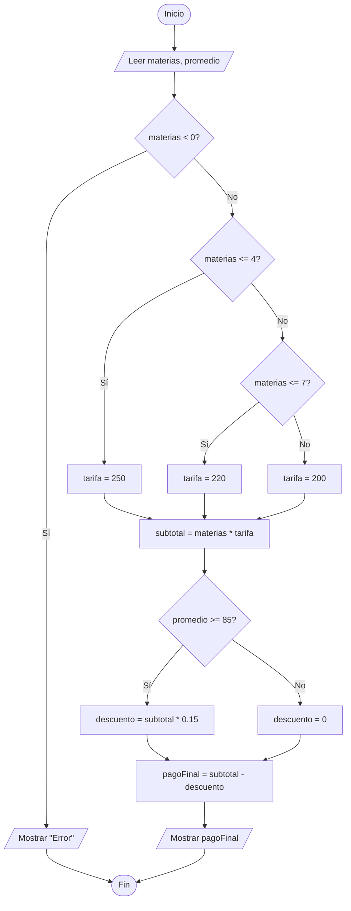

### Prueba de Escritorio

|**Paso**|**materias**|**promedio**|**tarifa**|**subtotal**|**descuento**|**pagoFinal**|**Salida Pantalla**|
|---|---|---|---|---|---|---|---|
|1|6|90.0|-|-|-|-|-|
|2|6|90.0|220.0|-|-|-|-|
|3|6|90.0|220.0|1320.0|-|-|-|
|4|6|90.0|220.0|1320.0|198.0|-|-|
|5|6|90.0|220.0|1320.0|198.0|1122.0|-|
|6|6|90.0|220.0|1320.0|198.0|1122.0|"Pago final: 1122.0 Bs"|

### Código Java

```Java
import java.util.Scanner;

public class MatriculaUniversitaria {
    public static void main(String[] args) {
        Scanner teclado = new Scanner(System.in);
        
        System.out.print("Ingrese la cantidad de materias: ");
        int materias = teclado.nextInt();
        
        System.out.print("Ingrese su promedio académico: ");
        double promedio = teclado.nextDouble();
        
        if (materias < 0) {
            System.out.println("Error: La cantidad de materias no puede ser negativa.");
        } else {
            double tarifa;
            
            if (materias <= 4) {
                tarifa = 250.0;
            } else if (materias <= 7) {
                tarifa = 220.0;
            } else {
                tarifa = 200.0;
            }
            
            double subtotal = materias * tarifa;
            double descuento;
            
            if (promedio >= 85) {
                descuento = subtotal * 0.15;
            } else {
                descuento = 0.0;
            }
            
            double pagoFinal = subtotal - descuento;
            System.out.println("Pago final: " + pagoFinal + " Bs");
        }
        
        teclado.close();
    }
}
```


# Sección III

## 2. TARIFA DE TRANSPORTE INTERDEPARTAMENTAL
Una terminal calcula el precio del pasaje según destino, edad y horario.

**Entradas:**

- destino: La Paz, Cochabamba o Santa Cruz
    
- edad
    
- horario: día o noche
    

**Reglas:**

Si el destino es válido:

Si destino = La Paz:

- día → 90 Bs
    
- noche → 110 Bs
    
    Si destino = Cochabamba:
    
- día → 80 Bs
    
- noche → 100 Bs
    
    Si destino = Santa Cruz:
    
- día → 140 Bs
    
- noche → 170 Bs
    

Después:

Si edad ≥ 60:

- descuento 20%
    
    Caso contrario:
    
- sin descuento
    

Si el destino no existe:

- error
    

**Salida:**

- Precio final
    

### Análisis

- **Datos requeridos:** La ciudad de destino (texto), la edad del pasajero (entero) y el horario de salida (texto).
    
- **Reglas de negocio:** 1. La regla principal es validar que el destino ingresado sea uno de los tres permitidos. Si no lo es, el proceso se detiene mostrando un error.
    
    2. El costo base del pasaje depende jerárquicamente de dos factores: primero el destino, y dentro de este, el horario de viaje (es aquí donde radica la anidación).
    
    3. Existe un descuento porcentual (20%) aplicable sobre el costo base únicamente para adultos mayores (60 años o más).
    
- **Cálculo y resultado:** Determinar la tarifa base según la intersección de destino y horario, calcular el descuento si corresponde, restar y emitir el precio final.
    

### Pseudocódigo

```Plaintext
INICIO
    LEER destino
    LEER edad
    LEER horario
    
    SI destino == "La Paz" O destino == "Cochabamba" O destino == "Santa Cruz" ENTONCES
        SI destino == "La Paz" ENTONCES
            SI horario == "dia" ENTONCES
                precioBase = 90
            SINO
                precioBase = 110
            FIN SI
        SINO SI destino == "Cochabamba" ENTONCES
            SI horario == "dia" ENTONCES
                precioBase = 80
            SINO
                precioBase = 100
            FIN SI
        SINO
            SI horario == "dia" ENTONCES
                precioBase = 140
            SINO
                precioBase = 170
            FIN SI
        FIN SI
        
        SI edad >= 60 ENTONCES
            descuento = precioBase * 0.20
        SINO
            descuento = 0
        FIN SI
        
        precioFinal = precioBase - descuento
        IMPRIMIR precioFinal
    SINO
        IMPRIMIR "Error: Destino no válido"
    FIN SI
FIN
```

### Diagrama de Flujo

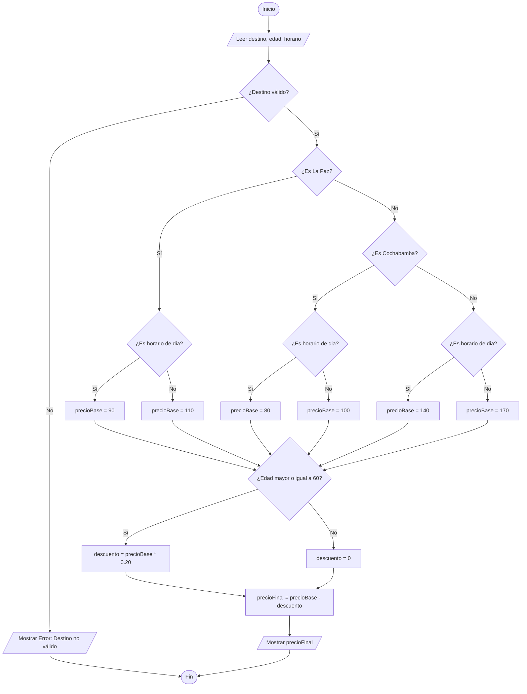

### Prueba de Escritorio

|**Paso**|**destino**|**edad**|**horario**|**precioBase**|**descuento**|**precioFinal**|**Salida Pantalla**|
|---|---|---|---|---|---|---|---|
|1|"Santa Cruz"|65|"noche"|-|-|-|-|
|2|"Santa Cruz"|65|"noche"|170.0|-|-|-|
|3|"Santa Cruz"|65|"noche"|170.0|34.0|-|-|
|4|"Santa Cruz"|65|"noche"|170.0|34.0|136.0|-|
|5|"Santa Cruz"|65|"noche"|170.0|34.0|136.0|"Precio final: 136.0 Bs"|

### Código Java

```Java
import java.util.Scanner;

public class TransporteTerminal {
    public static void main(String[] args) {
        Scanner teclado = new Scanner(System.in);
        
        System.out.print("Ingrese el destino (La Paz, Cochabamba o Santa Cruz): ");
        String destino = teclado.nextLine();
        
        System.out.print("Ingrese la edad: ");
        int edad = teclado.nextInt();
        
        System.out.print("Ingrese el horario (dia o noche): ");
        String horario = teclado.next();
        
        if (destino.equalsIgnoreCase("La Paz") || destino.equalsIgnoreCase("Cochabamba") || destino.equalsIgnoreCase("Santa Cruz")) {
            
            double precioBase = 0;
            
            if (destino.equalsIgnoreCase("La Paz")) {
                if (horario.equalsIgnoreCase("dia")) {
                    precioBase = 90;
                } else {
                    precioBase = 110;
                }
            } else if (destino.equalsIgnoreCase("Cochabamba")) {
                if (horario.equalsIgnoreCase("dia")) {
                    precioBase = 80;
                } else {
                    precioBase = 100;
                }
            } else if (destino.equalsIgnoreCase("Santa Cruz")) {
                if (horario.equalsIgnoreCase("dia")) {
                    precioBase = 140;
                } else {
                    precioBase = 170;
                }
            }
            
            double descuento;

            if (edad >= 60) {
                descuento = precioBase * 0.20;
            } else {
                descuento = 0.0;
            }
            
            double precioFinal = precioBase - descuento;
            System.out.println("Precio final: " + precioFinal + " Bs");
            
        } else {
            System.out.println("Error: Destino no válido.");
        }
        
        teclado.close();
    }
}
```

## 3. FACTURA DE ENERGÍA ELÉCTRICA INDUSTRIAL
Una empresa eléctrica calcula el pago según consumo y categoría industrial.

**Entradas:**

- consumo kWh
    
- categoría: A, B o C
    
- certificación ecológica (sí/no)
    

**Reglas:**

Si el consumo es válido:

Categoría A:

- Hasta 2000 kWh → 1.20 Bs
    
- Más de 2000 → 1.50 Bs
    
    Categoría B:
    
- Hasta 5000 kWh → 1.10 Bs
    
- Más de 5000 → 1.35 Bs
    
    Categoría C:
    
- Hasta 10000 kWh → 1.00 Bs
    
- Más de 10000 → 1.25 Bs
    

Después:

Si posee certificación ecológica:

- descuento 10%
    
    Caso contrario:
    
- sin descuento
    

**Salida:**

- Factura final
    

### Análisis

- **Datos requeridos:** Cantidad de energía consumida (numérico), letra de la categoría industrial (texto) y si posee sello ecológico (texto).
    
- **Reglas de negocio:**
    
    1. Asegurar que el consumo sea un valor positivo.
        
    2. La tarifa por kWh se decide evaluando primero la categoría de la empresa (A, B o C), y de forma anidada, evaluando si el consumo supera el umbral límite establecido para esa categoría específica.
        
    3. Bonificación ambiental: Las empresas con certificación obtienen un 10% de reducción sobre el monto facturado bruto.
        
- **Cálculo y resultado:** Multiplicar el consumo total por la tarifa específica encontrada. Calcular y deducir el porcentaje de descuento ecológico para obtener la factura final.
    

### Pseudocódigo

```Plaintext
INICIO
    LEER consumo
    LEER categoria
    LEER ecologica
    
    SI consumo <= 0 ENTONCES
        IMPRIMIR "Error: Consumo no válido"
    SINO
        SI categoria == "A" ENTONCES
            SI consumo <= 2000 ENTONCES
                tarifa = 1.20
            SINO
                tarifa = 1.50
            FIN SI
        SINO SI categoria == "B" ENTONCES
            SI consumo <= 5000 ENTONCES
                tarifa = 1.10
            SINO
                tarifa = 1.35
            FIN SI
        SINO SI categoria == "C" ENTONCES
            SI consumo <= 10000 ENTONCES
                tarifa = 1.00
            SINO
                tarifa = 1.25
            FIN SI
        FIN SI
        
        subtotal = consumo * tarifa
        
        SI ecologica == "si" ENTONCES
            descuento = subtotal * 0.10
        SINO
            descuento = 0
        FIN SI
        
        facturaFinal = subtotal - descuento
        IMPRIMIR facturaFinal
    FIN SI
FIN
```

### Diagrama de Flujo

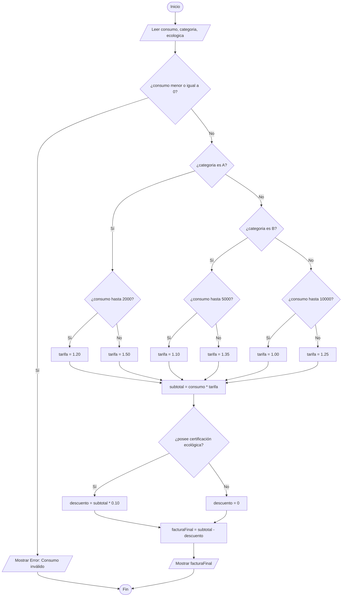

### Prueba de Escritorio

|**Paso**|**consumo**|**categoria**|**ecologica**|**tarifa**|**subtotal**|**descuento**|**facturaFinal**|**Salida Pantalla**|
|---|---|---|---|---|---|---|---|---|
|1|6000.0|"B"|"si"|-|-|-|-|-|
|2|6000.0|"B"|"si"|1.35|-|-|-|-|
|3|6000.0|"B"|"si"|1.35|8100.0|-|-|-|
|4|6000.0|"B"|"si"|1.35|8100.0|810.0|-|-|
|5|6000.0|"B"|"si"|1.35|8100.0|810.0|7290.0|-|
|6|6000.0|"B"|"si"|1.35|8100.0|810.0|7290.0|"Factura final: 7290.0 Bs"|

### Código Java

```Java
import java.util.Scanner;

public class EnergiaIndustrial {
    public static void main(String[] args) {
        Scanner teclado = new Scanner(System.in);
        
        System.out.print("Ingrese el consumo en kWh: ");
        double consumo = teclado.nextDouble();
        
        System.out.print("Ingrese la categoría (A, B o C): ");
        String categoria = teclado.next();
        
        System.out.print("¿Posee certificación ecológica? (si o no): ");
        String ecologica = teclado.next();
        
        if (consumo <= 0) {
            System.out.println("Error: Consumo no válido.");
        } else {
            double tarifa = 0;
            
            if (categoria.equalsIgnoreCase("A")) {
                if (consumo <= 2000) {
                    tarifa = 1.20;
                } else {
                    tarifa = 1.50;
                }
            } else if (categoria.equalsIgnoreCase("B")) {
                if (consumo <= 5000) {
                    tarifa = 1.10;
                } else {
                    tarifa = 1.35;
                }
            } else if (categoria.equalsIgnoreCase("C")) {
                if (consumo <= 10000) {
                    tarifa = 1.00;
                } else {
                    tarifa = 1.25;
                }
            } else {
                System.out.println("Categoría no reconocida.");
                System.exit(0);
            }
            
            double subtotal = consumo * tarifa;
            double descuento;
            
            if (ecologica.equalsIgnoreCase("si")) {
                descuento = subtotal * 0.10;
            } else {
                descuento = 0.0;
            }
            
            double facturaFinal = subtotal - descuento;
            System.out.println("Factura final: " + facturaFinal + " Bs");
        }
        
        teclado.close();
    }
}
```

## 5. COBRO DE SERVICIO DE NUBE EMPRESARIAL
Una empresa tecnológica cobra por almacenamiento y nivel de servicio.

**Entradas:**

- almacenamiento (TB)
    
- plan: básico, profesional o corporativo
    
- cliente VIP (sí/no)
    

**Reglas:**

Si el almacenamiento es válido:

Plan básico:

- Hasta 5 TB → 80 Bs/TB
    
- Más de 5 TB → 70 Bs/TB
    
    Plan profesional:
    
- Hasta 10 TB → 70 Bs/TB
    
- Más de 10 TB → 60 Bs/TB
    
    Plan corporativo:
    
- Hasta 20 TB → 60 Bs/TB
    
- Más de 20 TB → 50 Bs/TB
    

Después:

Si cliente VIP:

- descuento 18%
    
    Caso contrario:
    
- sin descuento
    

**Salida:**

- Pago mensual
    

### Análisis

- **Datos requeridos:** Capacidad ocupada en terabytes (numérico), tipo de suscripción (texto) y estatus de cuenta VIP (texto).
    
- **Reglas de negocio:**
    
    1. El espacio de almacenamiento debe ser un número mayor a cero para ser procesable.
        
    2. La lógica de cobro utiliza dos dimensiones: primero identifica el tipo de plan contratado, y de forma anidada, verifica si el volumen de TB excede el límite del tramo inicial para aplicar una tarifa reducida.
        
    3. Fidelidad: Cuentas marcadas como VIP gozan de una reducción del 18% sobre el monto base.
        
- **Cálculo y resultado:** Multiplicación de TB por la tarifa encontrada, menos el descuento VIP (si corresponde), mostrando el monto resultante.
    

### Pseudocódigo

```Plaintext
INICIO
    LEER almacenamiento
    LEER plan
    LEER clienteVIP
    
    SI almacenamiento <= 0 ENTONCES
        IMPRIMIR "Error: Almacenamiento inválido"
    SINO
        SI plan == "basico" ENTONCES
            SI almacenamiento <= 5 ENTONCES
                tarifa = 80
            SINO
                tarifa = 70
            FIN SI
        SINO SI plan == "profesional" ENTONCES
            SI almacenamiento <= 10 ENTONCES
                tarifa = 70
            SINO
                tarifa = 60
            FIN SI
        SINO SI plan == "corporativo" ENTONCES
            SI almacenamiento <= 20 ENTONCES
                tarifa = 60
            SINO
                tarifa = 50
            FIN SI
        FIN SI
        
        subtotal = almacenamiento * tarifa
        
        SI clienteVIP == "si" ENTONCES
            descuento = subtotal * 0.18
        SINO
            descuento = 0
        FIN SI
        
        pagoMensual = subtotal - descuento
        IMPRIMIR pagoMensual
    FIN SI
FIN
```

### Diagrama de Flujo

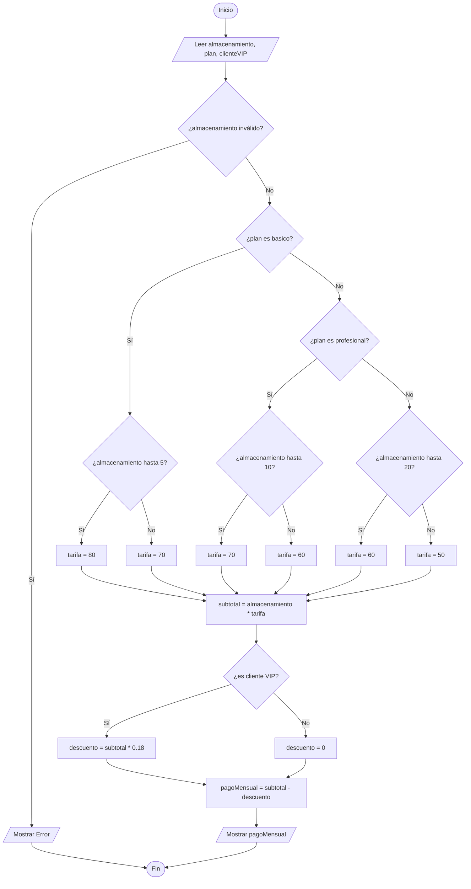

### Prueba de Escritorio

|**Paso**|**almacenamiento**|**plan**|**clienteVIP**|**tarifa**|**subtotal**|**descuento**|**pagoMensual**|**Salida Pantalla**|
|---|---|---|---|---|---|---|---|---|
|1|15.0|"profesional"|"si"|-|-|-|-|-|
|2|15.0|"profesional"|"si"|60|-|-|-|-|
|3|15.0|"profesional"|"si"|60|900.0|-|-|-|
|4|15.0|"profesional"|"si"|60|900.0|162.0|-|-|
|5|15.0|"profesional"|"si"|60|900.0|162.0|738.0|-|
|6|15.0|"profesional"|"si"|60|900.0|162.0|738.0|"Pago mensual: 738.0 Bs"|

### Código Java

```Java
import java.util.Scanner;

public class NubeEmpresarial {
    public static void main(String[] args) {
        Scanner teclado = new Scanner(System.in);
        
        System.out.print("Ingrese el almacenamiento en TB: ");
        double almacenamiento = teclado.nextDouble();
        
        System.out.print("Ingrese el plan (basico, profesional o corporativo): ");
        String plan = teclado.next();
        
        System.out.print("¿Es cliente VIP? (si o no): ");
        String clienteVIP = teclado.next();
        
        if (almacenamiento <= 0) {
            System.out.println("Error: Almacenamiento inválido.");
        } else {
            double tarifa = 0;
            
            if (plan.equalsIgnoreCase("basico")) {
                if (almacenamiento <= 5) {
                    tarifa = 80;
                } else {
                    tarifa = 70;
                }
            } else if (plan.equalsIgnoreCase("profesional")) {
                if (almacenamiento <= 10) {
                    tarifa = 70;
                } else {
                    tarifa = 60;
                }
            } else if (plan.equalsIgnoreCase("corporativo")) {
                if (almacenamiento <= 20) {
                    tarifa = 60;
                } else {
                    tarifa = 50;
                }
            }
            
            double subtotal = almacenamiento * tarifa;
            double descuento;
            
            if (clienteVIP.equalsIgnoreCase("si")) {
                descuento = subtotal * 0.18;
            } else {
                descuento = 0.0;
            }
            
            double pagoMensual = subtotal - descuento;
            System.out.println("Pago mensual final: " + pagoMensual + " Bs");
        }
        
        teclado.close();
    }
}
```

## 6. IMPUESTO MUNICIPAL DE INMUEBLES
Un municipio calcula el impuesto según el valor del inmueble y la zona.

**Entradas:**

- valor del inmueble
    
- zona: residencial, comercial o industrial
    
- propietario adulto mayor (sí/no)
    

**Reglas:**

Si el valor es válido:

Residencial:

- Hasta 500.000 Bs → 1.5%
    
- Más de 500.000 Bs → 2%
    
    Comercial:
    
- Hasta 1.000.000 Bs → 2.5%
    
- Más de 1.000.000 Bs → 3%
    
    Industrial:
    
- Hasta 2.000.000 Bs → 3.5%
    
- Más de 2.000.000 Bs → 4%
    

Después:

Si adulto mayor:

- descuento 10%
    
    Caso contrario:
    
- sin descuento
    

**Salida:**

- Impuesto final
    

### Análisis

- **Datos requeridos:** Avalúo del terreno/casa (numérico), distrito o zona urbana (texto) y condición de edad del propietario (texto).
    
- **Reglas de negocio:**
    
    1. Rechazar cálculos sobre avalúos negativos o iguales a cero.
        
    2. El porcentaje impositivo se deduce de una matriz de decisión: primero se evalúa la zonificación (residencial/comercial/industrial). Anidado a esto, se evalúa si el valor excede el tope definido para esa zona para gravar con una tasa impositiva mayor.
        
    3. Exenciones de ley: Propietarios de la tercera edad reciben una condonación del 10% del impuesto calculado.
        
- **Cálculo y resultado:** Determinar la tasa, aplicarla como porcentaje sobre el valor del inmueble para obtener el impuesto bruto, restar el descuento aplicable y mostrar el monto final de recaudación.
    

### Pseudocódigo

```Plaintext
INICIO
    LEER valor
    LEER zona
    LEER adultoMayor
    
    SI valor <= 0 ENTONCES
        IMPRIMIR "Error: Valor no válido"
    SINO
        SI zona == "residencial" ENTONCES
            SI valor <= 500000 ENTONCES
                porcentaje = 0.015
            SINO
                porcentaje = 0.02
            FIN SI
        SINO SI zona == "comercial" ENTONCES
            SI valor <= 1000000 ENTONCES
                porcentaje = 0.025
            SINO
                porcentaje = 0.03
            FIN SI
        SINO SI zona == "industrial" ENTONCES
            SI valor <= 2000000 ENTONCES
                porcentaje = 0.035
            SINO
                porcentaje = 0.04
            FIN SI
        FIN SI
        
        impuestoBase = valor * porcentaje
        
        SI adultoMayor == "si" ENTONCES
            descuento = impuestoBase * 0.10
        SINO
            descuento = 0
        FIN SI
        
        impuestoFinal = impuestoBase - descuento
        IMPRIMIR impuestoFinal
    FIN SI
FIN
```

### Diagrama de Flujo

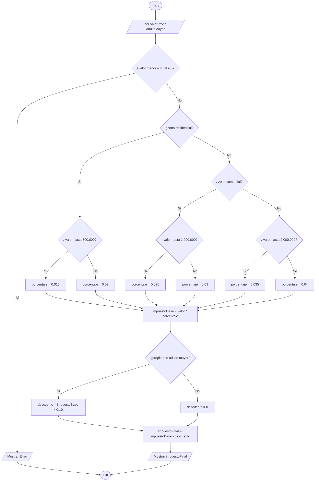

### Prueba de Escritorio

|**Paso**|**valor**|**zona**|**adultoMayor**|**porcentaje**|**impuestoBase**|**descuento**|**impuestoFinal**|**Salida Pantalla**|
|---|---|---|---|---|---|---|---|---|
|1|800000.0|"comercial"|"si"|-|-|-|-|-|
|2|800000.0|"comercial"|"si"|0.025|-|-|-|-|
|3|800000.0|"comercial"|"si"|0.025|20000.0|-|-|-|
|4|800000.0|"comercial"|"si"|0.025|20000.0|2000.0|-|-|
|5|800000.0|"comercial"|"si"|0.025|20000.0|2000.0|18000.0|-|
|6|800000.0|"comercial"|"si"|0.025|20000.0|2000.0|18000.0|"Impuesto final: 18000.0 Bs"|

### Código Java

```Java
import java.util.Scanner;

public class ImpuestoMunicipal {
    public static void main(String[] args) {
        Scanner teclado = new Scanner(System.in);
        
        System.out.print("Ingrese el valor comercial del inmueble: ");
        double valor = teclado.nextDouble();
        
        System.out.print("Ingrese la zona (residencial, comercial o industrial): ");
        String zona = teclado.next();
        
        System.out.print("¿El propietario es adulto mayor? (si o no): ");
        String adultoMayor = teclado.next();
        
        if (valor <= 0) {
            System.out.println("Error: Valor comercial no válido.");
        } else {
            double porcentaje = 0;
            
            if (zona.equalsIgnoreCase("residencial")) {
                if (valor <= 500000) {
                    porcentaje = 0.015;
                } else {
                    porcentaje = 0.02;
                }
            } else if (zona.equalsIgnoreCase("comercial")) {
                if (valor <= 1000000) {
                    porcentaje = 0.025;
                } else {
                    porcentaje = 0.03;
                }
            } else if (zona.equalsIgnoreCase("industrial")) {
                if (valor <= 2000000) {
                    porcentaje = 0.035;
                } else {
                    porcentaje = 0.04;
                }
            }
            
            double impuestoBase = valor * porcentaje;
            double descuento;
            
            if (adultoMayor.equalsIgnoreCase("si")) {
                descuento = impuestoBase * 0.10;
            } else {
                descuento = 0.0;
            }
            
            double impuestoFinal = impuestoBase - descuento;
            System.out.println("Impuesto final: " + impuestoFinal + " Bs");
        }
        
        teclado.close();
    }
}
```
