# Practica 2

### Ejercicio 1

**Enunciado:** Muestra los números múltiplos de 5 de 0 a 100 utilizando un bucle for.

**Análisis:**

```Plaintext
Ejemplo: 
Inicio en 0. 
¿0 es menor o igual a 100? Sí. Imprimo 0. Sumo 5.
Siguiente: 5. Imprimo 5. Sumo 5.
Siguiente: 10. Imprimo 10.
Un bucle for que empiece en 0, incremente de 5 en 5, y termine cuando pase de 100.
```

**Pseudocódigo:**

```Plaintext
1. Inicio
2. Declarar variable i
3. Para i desde 0 hasta 100 con paso 5 hacer:
    4. Imprimir i
4. Fin Para
5. Fin
```

**Diagrama de Flujo:**


**Prueba de Escritorio:**

|**i**|**i <= 100**|**Imprime**|**Nuevo i**|
|---|---|---|---|
|0|Sí|0|5|
|5|Sí|5|10|
|...|...|...|...|
|100|Sí|100|105|
|105|No|-|-|

**Código Java:**

```Java
public class MultiplosCincoFor {
    public static void main(String[] args) {
        for (int i = 0; i <= 100; i += 5) {
            System.out.print(i + " ");
        }
    }
}
```

### Ejercicio 4

**Enunciado:** Muestra los números del 320 al 160, contando de 20 en 20 hacia atrás utilizando un bucle for.

**Análisis:**


```Plaintext
Ejemplo de la secuencia:
Inicio: 320.
Restamos 20 -> 300.
Restamos 20 -> 280.
...
Llegamos a 160 y ahí paramos. El for debe inicializarse en 320, restar 20 por ciclo y la condición es mientras sea mayor o igual a 160.
```

**Pseudocódigo:**

```Plaintext
1. Inicio
2. Declarar variable i
3. Para i desde 320 hasta 160 con paso -20 hacer:
    4. Imprimir i
4. Fin Para
5. Fin
```

**Diagrama de Flujo:**

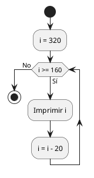

**Prueba de Escritorio:**

|**i**|**i >= 160**|**Imprime**|**Nuevo i**|
|---|---|---|---|
|320|Sí|320|300|
|300|Sí|300|280|
|...|...|...|...|
|160|Sí|160|140|
|140|No|-|-|

**Código Java:**

```Java
public class CuentaAtrasFor {
    public static void main(String[] args) {
        for (int i = 320; i >= 160; i -= 20) {
            System.out.print(i + " ");
        }
    }
}
```

### Ejercicio 7

**Enunciado:** Realiza el control de acceso a una caja fuerte. La combinación será un número de 4 cifras. El programa nos pedirá la combinación para abrirla. Si no acertamos, se nos mostrará el mensaje "Lo siento, esa no es la combinación" y si acertamos se nos dirá "La caja fuerte se ha abierto satisfactoriamente". Tendremos cuatro oportunidades para abrir la caja fuerte.

**Análisis:**

```Plaintext
Ejemplo: Combinación correcta es 1234.
Intento 1: 0000 -> "Lo siento..." (quedan 3)
Intento 2: 1111 -> "Lo siento..." (quedan 2)
Intento 3: 1234 -> "Caja fuerte abierta" -> CORTAR EL CICLO.
Un while controlará que el número de intentos sea mayor a 0 y que no se haya acertado aún.
```

**Pseudocódigo:**

```Plaintext
1. Inicio
2. clave = 1234, intentos = 4, acertado = falso, ingreso
3. Mientras intentos > 0 y acertado == falso hacer:
    4. Leer ingreso
    5. Si ingreso == clave entonces:
        6. acertado = verdadero
        7. Imprimir "La caja fuerte se ha abierto satisfactoriamente"
    6. Sino:
        9. intentos = intentos - 1
        10. Imprimir "Lo siento, esa no es la combinación"
4. Fin Mientras
5. Fin
```

**Diagrama de Flujo:**

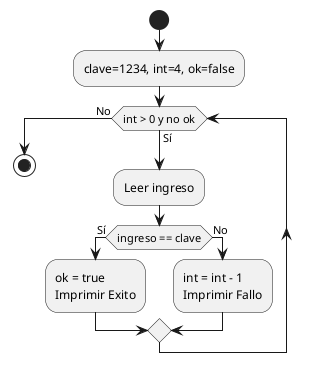

**Prueba de Escritorio:**

|**int**|**ok**|**ingreso**|**ingreso == clave**|**Mensaje**|**Nuevo int**|
|---|---|---|---|---|---|
|4|false|1111|No|Lo siento...|3|
|3|false|1234|Sí|Abierta...|3 (ok=true)|

**Código Java:**

```Java
import java.util.Scanner;

public class CajaFuerte {
    public static void main(String[] args) {
        Scanner sc = new Scanner(System.in);
        int clave = 1234;
        int intentos = 4;
        boolean acertado = false;
        
        while (intentos > 0 && !acertado) {
            System.out.print("Ingrese combinación: ");
            int ingreso = sc.nextInt();
            
            if (ingreso == clave) {
                acertado = true;
                System.out.println("La caja fuerte se ha abierto satisfactoriamente");
            } else {
                intentos--;
                System.out.println("Lo siento, esa no es la combinación");
            }
        }
        sc.close();
    }
}
```

### Ejercicio 8

**Enunciado:** Muestra la tabla de multiplicar de un número introducido por teclado.

**Análisis:**

```Plaintext
Ejemplo: n = 5
5 x 1 = 5
5 x 2 = 10
...
5 x 10 = 50
Un for de 1 a 10 que multiplique iterador 'i' por el número introducido 'n'.
```

**Pseudocódigo:**

```Plaintext
1. Inicio
2. Leer n
3. Para i desde 1 hasta 10 hacer:
    4. Imprimir n + " x " + i + " = " + (n * i)
4. Fin Para
5. Fin
```

**Diagrama de Flujo:**

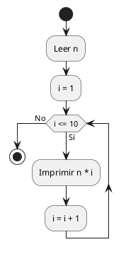

**Prueba de Escritorio:** (Para n = 5)

|**i**|**i <= 10**|**Imprime**|
|---|---|---|
|1|Sí|5 x 1 = 5|
|2|Sí|5 x 2 = 10|
|...|...|...|
|10|Sí|5 x 10 = 50|

**Código Java:**

```Java
import java.util.Scanner;

public class TablaMultiplicar {
    public static void main(String[] args) {
        Scanner sc = new Scanner(System.in);
        System.out.print("Número: ");
        int n = sc.nextInt();
        
        for (int i = 1; i <= 10; i++) {
            System.out.println(n + " x " + i + " = " + (n * i));
        }
        sc.close();
    }
}
```

### Ejercicio 9

**Enunciado:** Realiza un programa que nos diga cuántos dígitos tiene un número introducido por teclado.

**Análisis:**

```Plaintext
Ejemplo: n = 458
458 / 10 = 45 -> cuento 1
45 / 10 = 4 -> cuento 2
4 / 10 = 0 -> cuento 3
Fin. Usar divisiones sucesivas entre 10 mientras el número sea mayor a 0 incrementando un contador.
```

**Pseudocódigo:**

```Plaintext
1. Inicio
2. Leer n
3. contador = 0
4. Si n == 0 entonces contador = 1
5. Mientras n > 0 hacer:
    6. n = n DIV 10
    7. contador = contador + 1
6. Fin Mientras
7. Imprimir contador
8. Fin
```

**Diagrama de Flujo:**

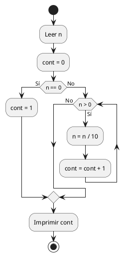

**Prueba de Escritorio:**

|**n**|**n > 0**|**cont**|**Nuevo n**|
|---|---|---|---|
|458|Sí|1|45|
|45|Sí|2|4|
|4|Sí|3|0|
|0|No|3|-|

**Código Java:**

```Java
import java.util.Scanner;

public class ContarDigitos {
    public static void main(String[] args) {
        Scanner sc = new Scanner(System.in);
        System.out.print("Número: ");
        int n = sc.nextInt();
        int cont = 0;
        
        if (n == 0) cont = 1;
        
        while (n > 0) {
            n /= 10;
            cont++;
        }
        
        System.out.println("Tiene " + cont + " dígitos.");
        sc.close();
    }
}
```

### Ejercicio 10

**Enunciado:** Escribe un programa que calcule la media de un conjunto de números positivos introducidos por teclado. A priori, el programa no sabe cuántos números se introducirán. El usuario indicará que ha terminado de introducir los datos cuando meta un número negativo.

**Análisis:**

```Plaintext
Ejemplo: Meto 5, 10, 15, -1
n = 5 -> suma = 5, cont = 1
n = 10 -> suma = 15, cont = 2
n = 15 -> suma = 30, cont = 3
n = -1 -> sale.
Media = 30 / 3 = 10.
Un while mientras n >= 0 que acumule en suma y aumente el contador.
```

**Pseudocódigo:**

```Plaintext
1. Inicio
2. suma = 0, cont = 0
3. Leer n
4. Mientras n >= 0 hacer:
    5. suma = suma + n
    6. cont = cont + 1
    7. Leer n
5. Fin Mientras
6. Si cont > 0 Imprimir suma / cont
7. Fin
```

**Diagrama de Flujo:**

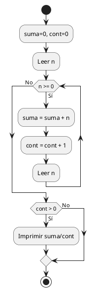

**Prueba de Escritorio:**

|**n**|**n >= 0**|**suma**|**cont**|
|---|---|---|---|
|5|Sí|5|1|
|10|Sí|15|2|
|-1|No|15|2|

**Código Java:**

```Java
import java.util.Scanner;

public class MediaPositivos {
    public static void main(String[] args) {
        Scanner sc = new Scanner(System.in);
        double suma = 0;
        int cont = 0;
        
        System.out.print("Ingrese número: ");
        double n = sc.nextDouble();
        
        while (n >= 0) {
            suma += n;
            cont++;
            System.out.print("Ingrese número: ");
            n = sc.nextDouble();
        }
        
        if (cont > 0) {
            System.out.println("Media: " + (suma / cont));
        }
        sc.close();
    }
}
```

### Ejercicio 12

**Enunciado:** Escribe un programa que muestre los n primeros términos de la serie de Fibonacci.

**Análisis:**

```Plaintext
Ejemplo: N = 5
f1=0, f2=1
Muestra: 0, 1
Iteración 1: f3 = 0+1=1. f1=1, f2=1. (Muestra 1)
Iteración 2: f3 = 1+1=2. f1=1, f2=2. (Muestra 2)
Iteración 3: f3 = 1+2=3. f1=2, f2=3. (Muestra 3)
Total mostrados: 0, 1, 1, 2, 3. Un for que repita la suma de los anteriores.
```

**Pseudocódigo:**

```Plaintext
1. Inicio
2. Leer n
3. f1 = 0, f2 = 1
4. Imprimir f1, f2
5. Para i desde 3 hasta n hacer:
    6. f3 = f1 + f2
    7. Imprimir f3
    8. f1 = f2
    9. f2 = f3
6. Fin Para
7. Fin
```

**Diagrama de Flujo:**

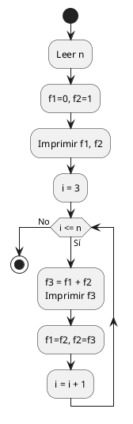

**Prueba de Escritorio:** (n = 5)

|**i**|**i <= 5**|**f3 (Impreso)**|**f1 (nuevo)**|**f2 (nuevo)**|
|---|---|---|---|---|
|(inicio)|-|0, 1|0|1|
|3|Sí|1|1|1|
|4|Sí|2|1|2|
|5|Sí|3|2|3|

**Código Java:**

```Java
import java.util.Scanner;

public class FibonacciN {
    public static void main(String[] args) {
        Scanner sc = new Scanner(System.in);
        System.out.print("Ingrese n: ");
        int n = sc.nextInt();
        
        int f1 = 0, f2 = 1;
        if(n >= 1) System.out.print(f1 + " ");
        if(n >= 2) System.out.print(f2 + " ");
        
        for (int i = 3; i <= n; i++) {
            int f3 = f1 + f2;
            System.out.print(f3 + " ");
            f1 = f2;
            f2 = f3;
        }
        System.out.println();
        sc.close();
    }
}
```

### Ejercicio 13

**Enunciado:** Escribe un programa que lea una lista de diez números y determine cuántos son positivos, y cuántos son negativos.

**Análisis:**

```Plaintext
Ejemplo (resumido a 3 números): -5, 2, 0
i=1: -5 < 0 -> neg = 1
i=2: 2 > 0 -> pos = 1
i=3: 0 (ni positivo ni negativo)
Es un for de 1 a 10 con ifs dentro.
```

**Pseudocódigo:**

```Plaintext
1. Inicio
2. pos = 0, neg = 0
3. Para i desde 1 hasta 10 hacer:
    4. Leer n
    5. Si n > 0 pos = pos + 1
    6. Sino Si n < 0 neg = neg + 1
4. Fin Para
5. Imprimir pos, neg
6. Fin
```

**Diagrama de Flujo:**

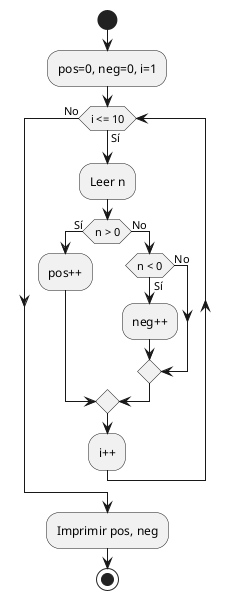

**Prueba de Escritorio:**

|**i**|**n**|**n > 0**|**n < 0**|**pos**|**neg**|
|---|---|---|---|---|---|
|1|5|Sí|No|1|0|
|2|-3|No|Sí|1|1|
|3|0|No|No|1|1|

**Código Java:**

```Java
import java.util.Scanner;

public class PositivosNegativos {
    public static void main(String[] args) {
        Scanner sc = new Scanner(System.in);
        int pos = 0, neg = 0;
        
        for (int i = 1; i <= 10; i++) {
            System.out.print("Número " + i + ": ");
            int n = sc.nextInt();
            if (n > 0) pos++;
            else if (n < 0) neg++;
        }
        
        System.out.println("Positivos: " + pos);
        System.out.println("Negativos: " + neg);
        sc.close();
    }
}
```

### Ejercicio 16

**Enunciado:** Escribe un programa que diga si un número introducido por teclado es o no primo. Un número primo es aquel que sólo es divisible entre él mismo y la unidad.

**Análisis:**

```Plaintext
Ejemplo n = 7
2: 7 % 2 != 0
3: 7 % 3 != 0
4, 5, 6... ninguno divide. Es primo.
Ejemplo n = 4
2: 4 % 2 == 0 -> No es primo, corto el bucle.
```

**Pseudocódigo:**

```Plaintext
1. Inicio
2. Leer n
3. esPrimo = verdadero
4. Para i desde 2 hasta n/2 hacer:
    5. Si n MOD i == 0 entonces:
        6. esPrimo = falso
        7. Romper bucle
5. Fin Para
6. Si esPrimo Imprimir "Es primo" Sino Imprimir "No es primo"
7. Fin
```

**Diagrama de Flujo:**

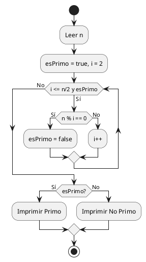

**Prueba de Escritorio:** (Para n = 5)

|**i**|**i <= 2**|**5 % i == 0**|**esPrimo**|
|---|---|---|---|
|2|Sí|No|true|
|3|No|-|true|

**Código Java:**

```Java
import java.util.Scanner;

public class EsPrimo {
    public static void main(String[] args) {
        Scanner sc = new Scanner(System.in);
        System.out.print("Número: ");
        int n = sc.nextInt();
        boolean esPrimo = true;
        
        if(n <= 1) esPrimo = false;
        
        for (int i = 2; i <= n / 2 && esPrimo; i++) {
            if (n % i == 0) {
                esPrimo = false;
            }
        }
        
        if (esPrimo) System.out.println("Es primo");
        else System.out.println("No es primo");
        
        sc.close();
    }
}
```

### Ejercicio 18

**Enunciado:** Escribe un programa que obtenga los números enteros comprendidos entre dos números introducidos por teclado y validados como distintos, el programa debe empezar por el menor de los enteros introducidos e ir incrementando de 7 en 7.

**Análisis:**

```Plaintext
Ejemplo: Meto 20 y 2.
El menor es 2. El mayor es 20.
Empieza en 2.
Siguiente: 2+7=9.
Siguiente: 9+7=16.
Siguiente: 16+7=23 (Se pasa de 20, fin).
Verificamos el menor y mayor, y hacemos un for con paso 7.
```

**Pseudocódigo:**

```Plaintext
1. Inicio
2. Leer a, b
3. Si a > b entonces menor = b, mayor = a
4. Sino menor = a, mayor = b
5. Para i desde menor hasta mayor con paso 7 hacer:
    6. Imprimir i
6. Fin Para
7. Fin
```

**Diagrama de Flujo:**

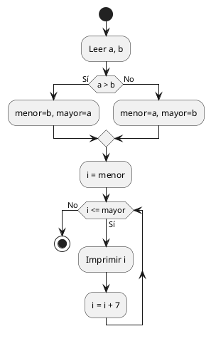

**Prueba de Escritorio:** (a=20, b=2)

|**i**|**i <= 20**|**Imprime**|**Nuevo i**|
|---|---|---|---|
|2|Sí|2|9|
|9|Sí|9|16|
|16|Sí|16|23|
|23|No|-|-|

**Código Java:**

```Java
import java.util.Scanner;

public class RangoSiete {
    public static void main(String[] args) {
        Scanner sc = new Scanner(System.in);
        System.out.print("Ingrese a y b: ");
        int a = sc.nextInt();
        int b = sc.nextInt();
        
        int menor = Math.min(a, b);
        int mayor = Math.max(a, b);
        
        for (int i = menor; i <= mayor; i += 7) {
            System.out.print(i + " ");
        }
        sc.close();
    }
}
```

### Ejercicio 19

**Enunciado:** Realiza un programa que pinte una pirámide por pantalla. La altura se debe pedir por teclado. El carácter con el que se pinta la pirámide también se debe pedir por teclado.

**Análisis:**

```Plaintext
Ejemplo: altura = 3, char = '*'
Fila 1: 2 espacios, 1 '*'.
Fila 2: 1 espacio, 3 '*'.
Fila 3: 0 espacios, 5 '*'.
Cantidad de espacios = altura - i. Cantidad de chars = 2 * i - 1. Dos for internos.
```

**Pseudocódigo:**

```Plaintext
1. Inicio
2. Leer altura, char
3. Para i desde 1 hasta altura hacer:
    4. Para j desde 1 hasta altura - i hacer: Imprimir espacio
    5. Para k desde 1 hasta (2*i - 1) hacer: Imprimir char
    6. Imprimir salto de linea
4. Fin Para
5. Fin
```

**Diagrama de Flujo:**

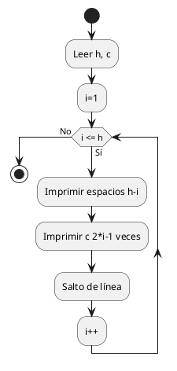

**Prueba de Escritorio:** (h=2, c='#')

|**i**|**Espacios (2-i)**|**Caracteres (2i-1)**|
|---|---|---|
|1|1|1 ('#')|
|2|0|3 ('###')|

**Código Java:**

```Java
import java.util.Scanner;

public class PiramideCar {
    public static void main(String[] args) {
        Scanner sc = new Scanner(System.in);
        System.out.print("Altura: ");
        int h = sc.nextInt();
        System.out.print("Carácter: ");
        char c = sc.next().charAt(0);
        
        for (int i = 1; i <= h; i++) {
            for (int j = 1; j <= h - i; j++) System.out.print(" ");
            for (int k = 1; k <= (2 * i - 1); k++) System.out.print(c);
            System.out.println();
        }
        sc.close();
    }
}
```

### Ejercicio 21

**Enunciado:** Realiza un programa que vaya pidiendo números hasta que se introduzca un número negativo y nos diga cuantos números se han introducido, la media de los impares y el mayor de los pares. El número negativo sólo se utiliza para indicar el final...

**Análisis:**

```Plaintext
Ejemplo: Meto 4, 3, 5, -1
n=4 -> par, maxPar=4. cont=1.
n=3 -> impar, sumImp=3, contImp=1. cont=2.
n=5 -> impar, sumImp=8, contImp=2. cont=3.
n=-1 -> CORTA.
Muestra: total=3, media impares=4, maxPar=4.
```

**Pseudocódigo:**

```Plaintext
1. Inicio
2. cont=0, sumImp=0, contImp=0, maxPar=0
3. Leer n
4. Mientras n >= 0 hacer:
    5. cont++
    6. Si n MOD 2 == 0 entonces:
        7. Si n > maxPar maxPar = n
    7. Sino:
        9. sumImp += n, contImp++
    8. Leer n
5. Fin Mientras
6. Imprimir cont, sumImp/contImp, maxPar
7. Fin
```

**Diagrama de Flujo:**

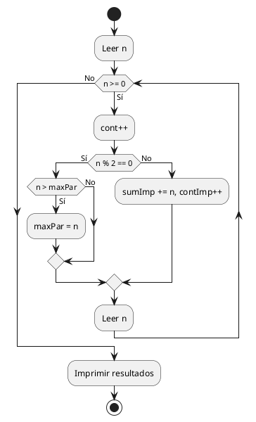

**Prueba de Escritorio:**

|**n**|**Par?**|**maxPar**|**sumImp**|**contImp**|**contTotal**|
|---|---|---|---|---|---|
|4|Sí|4|0|0|1|
|3|No|4|3|1|2|
|-1|-|4|3|1|2|

**Código Java:**

```Java
import java.util.Scanner;

public class EstadisticasParesImpares {
    public static void main(String[] args) {
        Scanner sc = new Scanner(System.in);
        int cont = 0, sumImp = 0, contImp = 0, maxPar = 0;
        System.out.print("Número: ");
        int n = sc.nextInt();
        
        while (n >= 0) {
            cont++;
            if (n % 2 == 0) {
                if (n > maxPar) maxPar = n;
            } else {
                sumImp += n;
                contImp++;
            }
            n = sc.nextInt();
        }
        
        System.out.println("Total introducidos: " + cont);
        if(contImp > 0) System.out.println("Media impares: " + (sumImp / (double)contImp));
        System.out.println("Mayor par: " + maxPar);
        sc.close();
    }
}
```

### Ejercicio 23

**Enunciado:** Escribe un programa que permita ir introduciendo una serie indeterminada de números mientras su suma no supere el valor 10000. Cuando esto último ocurra, se debe mostrar el total acumulado, el contador de los números introducidos y la media.

**Análisis:**

```Plaintext
Ejemplo: Suma límite 100 (para ilustrar, el código usará 10000).
Ingreso 50 (suma=50). Sigue.
Ingreso 60 (suma=110). 110 supera 100, entonces CORTA.
Total acumulado 110, cont=2. Media=55.
Bucle while(suma <= 10000).
```

**Pseudocódigo:**

```Plaintext
1. Inicio
2. suma=0, cont=0
3. Mientras suma <= 10000 hacer:
    4. Leer n
    5. suma += n
    6. cont++
4. Fin Mientras
5. Imprimir suma, cont, suma/cont
6. Fin
```

**Diagrama de Flujo:**

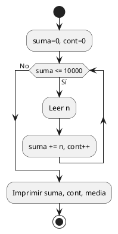

**Prueba de Escritorio:**

|**suma ini**|**suma <= 10**|**n**|**suma fin**|**cont**|
|---|---|---|---|---|
|0|Sí|6|6|1|
|6|Sí|5|11|2|
|11|No|-|11|2|

**Código Java:**

```Java
import java.util.Scanner;

public class SumaDiezMil {
    public static void main(String[] args) {
        Scanner sc = new Scanner(System.in);
        int suma = 0;
        int cont = 0;
        
        while (suma <= 10000) {
            System.out.print("Número: ");
            int n = sc.nextInt();
            suma += n;
            cont++;
        }
        
        System.out.println("Suma total: " + suma);
        System.out.println("Cantidad: " + cont);
        System.out.println("Media: " + ((double)suma / cont));
        sc.close();
    }
}
```

### Ejercicio 25

**Enunciado:** Realiza un programa que pida un número por teclado y que luego muestre ese número al revés.

**Análisis:**

```Plaintext
Ejemplo: 456
Saco 6, lo pongo en inv.
Saco 5, multiplico inv por 10 (queda 60) y sumo 5 = 65.
Saco 4, multiplico inv por 10 (queda 650) y sumo 4 = 654.
Fórmula de bucle: inv = inv * 10 + (n % 10), dividiendo n entre 10 en cada paso.
```

**Pseudocódigo:**

```Plaintext
1. Inicio
2. Leer n
3. inv = 0
4. Mientras n > 0 hacer:
    5. inv = inv * 10 + (n % 10)
    6. n = n / 10
5. Fin Mientras
6. Imprimir inv
7. Fin
```

**Diagrama de Flujo:**

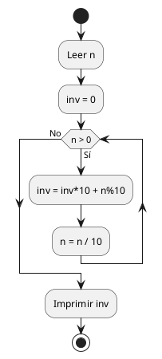

**Prueba de Escritorio:**

|**n**|**n > 0**|**n % 10**|**inv * 10 + mod**|
|---|---|---|---|
|456|Sí|6|6|
|45|Sí|5|65|
|4|Sí|4|654|
|0|No|-|-|

**Código Java:**

```Java
import java.util.Scanner;

public class NumeroReves {
    public static void main(String[] args) {
        Scanner sc = new Scanner(System.in);
        System.out.print("Número: ");
        int n = sc.nextInt();
        int inv = 0;
        
        while (n > 0) {
            inv = inv * 10 + (n % 10);
            n /= 10;
        }
        
        System.out.println("Al revés: " + inv);
        sc.close();
    }
}
```

### Ejercicio 27

**Enunciado:** Escribe un programa que muestre, cuente y sume los múltiplos de 3 que hay entre 1 y un número leído por teclado.

**Análisis:**

```Plaintext
Ejemplo: N = 7
i=1, no es
i=2, no es
i=3, es múltiplo! Imprimo 3, cont=1, suma=3
i=4,5 no son
i=6, es múltiplo! Imprimo 6, cont=2, suma=9
i=7, no es. Fin.
Un for con un if (i % 3 == 0) y variables acumuladoras.
```

**Pseudocódigo:**

```Plaintext
1. Inicio
2. Leer n
3. cont=0, suma=0
4. Para i desde 1 hasta n hacer:
    5. Si i MOD 3 == 0 entonces:
        6. Imprimir i
        7. cont++
        8. suma += i
5. Fin Para
6. Imprimir cont, suma
7. Fin
```

**Diagrama de Flujo:**

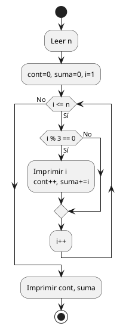

**Prueba de Escritorio:** (Para n = 4)

|**i**|**i % 3 == 0**|**Imprime**|**cont**|**suma**|
|---|---|---|---|---|
|1|No|-|0|0|
|2|No|-|0|0|
|3|Sí|3|1|3|
|4|No|-|1|3|

**Código Java:**

```Java
import java.util.Scanner;

public class MultiplosTres {
    public static void main(String[] args) {
        Scanner sc = new Scanner(System.in);
        System.out.print("Número: ");
        int n = sc.nextInt();
        int cont = 0, suma = 0;
        
        for (int i = 1; i <= n; i++) {
            if (i % 3 == 0) {
                System.out.print(i + " ");
                cont++;
                suma += i;
            }
        }
        
        System.out.println("\nCuenta: " + cont);
        System.out.println("Suma: " + suma);
        sc.close();
    }
}
```

### Ejercicio 28

**Enunciado:** Escribe un programa que calcule el factorial de un número entero leído por teclado.

**Análisis:**

```Plaintext
Ejemplo: n = 4
Factorial es 1 * 2 * 3 * 4.
Inicio fact = 1.
i=1 -> fact = 1*1 = 1
i=2 -> fact = 1*2 = 2
i=3 -> fact = 2*3 = 6
i=4 -> fact = 6*4 = 24.
Un for iterativo acumulando en producto.
```

**Pseudocódigo:**

```Plaintext
1. Inicio
2. Leer n
3. fact = 1
4. Para i desde 1 hasta n hacer:
    5. fact = fact * i
5. Fin Para
6. Imprimir fact
7. Fin
```

**Diagrama de Flujo:**

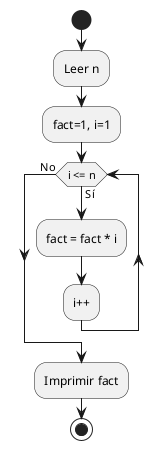

**Prueba de Escritorio:** (n = 3)

|**i**|**i <= 3**|**fact (antes)**|**Nuevo fact**|
|---|---|---|---|
|1|Sí|1|1|
|2|Sí|1|2|
|3|Sí|2|6|

**Código Java:**

```Java
import java.util.Scanner;

public class Factorial {
    public static void main(String[] args) {
        Scanner sc = new Scanner(System.in);
        System.out.print("Número: ");
        int n = sc.nextInt();
        long fact = 1;
        
        for (int i = 1; i <= n; i++) {
            fact *= i;
        }
        
        System.out.println("Factorial: " + fact);
        sc.close();
    }
}
```

### Ejercicio 31

**Enunciado:** Realiza un programa que pinte la letra L por pantalla hecha con asteriscos. El programa pedirá la altura. El palo horizontal de la L tendrá una longitud de la mitad de la altura más uno.

**Análisis:**

```Plaintext
Ejemplo: Altura = 5. Mitad es 5/2 = 2. Mas uno = 3. 
Imprime 4 veces un "*" (altura - 1 veces, el palo vertical).
La ultima linea imprime 3 veces "* " (el palo horizontal).
```

**Pseudocódigo:**

```Plaintext
1. Inicio
2. Leer altura
3. Para i desde 1 hasta altura - 1 hacer:
    4. Imprimir "*"
4. base = (altura / 2) + 1
5. Para j desde 1 hasta base hacer:
    7. Imprimir "* " en la misma línea
6. Fin
```

**Diagrama de Flujo:**

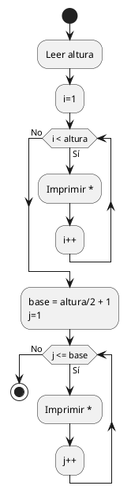

**Prueba de Escritorio:** (h = 3, base = 1+1=2)

|**Fila**|**Qué imprime**|
|---|---|
|1|*|
|2|*|
|3|* *|

**Código Java:**

```Java
import java.util.Scanner;

public class LetraL {
    public static void main(String[] args) {
        Scanner sc = new Scanner(System.in);
        System.out.print("Introduzca la altura de la L: ");
        int h = sc.nextInt();
        
        for (int i = 1; i < h; i++) {
            System.out.println("*");
        }
        
        int base = (h / 2) + 1;
        for (int i = 1; i <= base; i++) {
            System.out.print("* ");
        }
        System.out.println();
        sc.close();
    }
}
```
