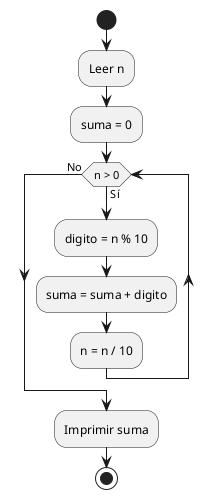
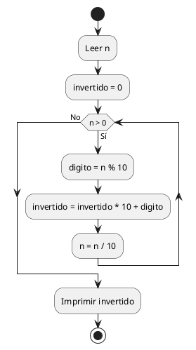
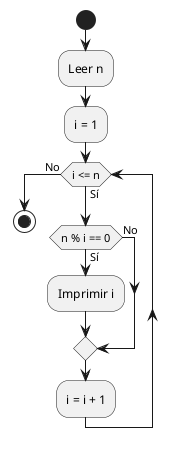
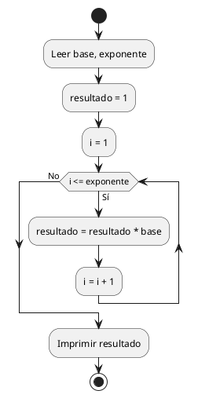
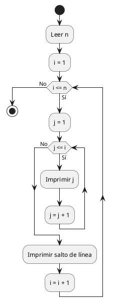
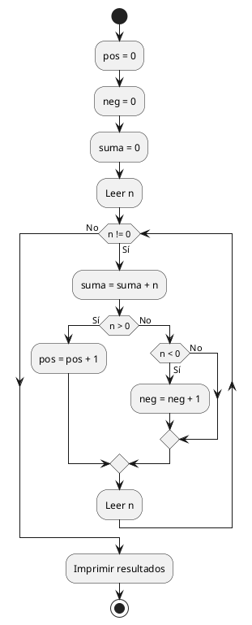
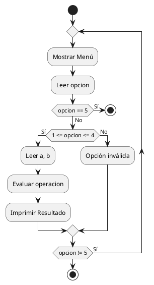
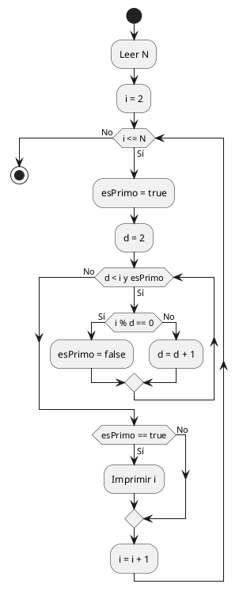

# Tarea 2
### Ejercicio 31

**Tema:** WHILE - Suma de dígitos

**Enunciado:** Ingresar un número entero positivo y calcular la suma de todos sus dígitos.

**Análisis:**

```Plaintext
Ejemplo: n = 458
458 % 10 = 8 -> suma = 0 + 8 = 8, n = 458 / 10 = 45
45 % 10 = 5 -> suma = 8 + 5 = 13, n = 45 / 10 = 4
4 % 10 = 4 -> suma = 13 + 4 = 17, n = 4 / 10 = 0
Fin. Solo es ir sacando el residuo con 10 para agarrar el último dígito y dividir entre 10 para cortarlo, todo dentro de un ciclo while.
```

**Pseudocódigo:**

```Plaintext
1. Inicio
2. Declarar variables: n, suma, digito
3. Leer n
4. Asignar suma = 0
5. Mientras n > 0 hacer:
    6. digito = n MOD 10
    7. suma = suma + digito
    8. n = n DIV 10
6. Fin Mientras
7. Imprimir suma
8. Fin
```

**Diagrama de Flujo:**



**Prueba de Escritorio:**

|**n**|**suma**|**n > 0**|**digito**|**nueva suma**|**nuevo n**|
|---|---|---|---|---|---|
|458|0|Sí|8|8|45|
|45|8|Sí|5|13|4|
|4|13|Sí|4|17|0|
|0|17|No|-|-|-|

**Código Java:**

```Java
import java.util.Scanner;

public class SumaDigitos {
    public static void main(String[] args) {
        Scanner scanner = new Scanner(System.in);
        System.out.print("Ingrese un número entero positivo: ");
        int n = scanner.nextInt();
        int suma = 0;
        
        while (n > 0) {
            int digito = n % 10;
            suma += digito;
            n /= 10;
        }
        
        System.out.println(suma);
        scanner.close();
    }
}
```

### Ejercicio 34

**Tema:** WHILE - Número invertido

**Enunciado:** Mostrar un número entero con sus dígitos invertidos.

**Análisis:**

```Plaintext
Ejemplo: n = 123
n=123 -> digito=3 -> inv = (0 * 10)+3 = 3 -> n=12 
n=12 -> digito=2 -> inv = (3 * 10)+2 = 32 -> n=1
n=1 -> digito=1 -> inv = (32 * 10)+1 = 321 -> n=0
La clave del algoritmo es la fórmula inv = (inv * 10) + (n % 10) repetida hasta que n se vuelva 0.
```

**Pseudocódigo:**

```Plaintext
1. Inicio
2. Declarar variables: n, invertido, digito
3. Leer n
4. Asignar invertido = 0
5. Mientras n > 0 hacer:
    6. digito = n MOD 10
    7. invertido = (invertido * 10) + digito
    8. n = n DIV 10
6. Fin Mientras
7. Imprimir invertido
8. Fin
```

**Diagrama de Flujo:**



**Prueba de Escritorio:**

| **n** | **invertido** | **n > 0** | **digito** | **nuevo invertido** | **nuevo n** |
| ----- | ------------- | --------- | ---------- | ------------------- | ----------- |
| 123   | 0             | Sí        | 3          | 3                   | 12          |
| 12    | 3             | Sí        | 2          | 32                  | 1           |
| 1     | 32            | Sí        | 1          | 321                 | 0           |
| 0     | 321           | No        | -          | -                   | -           |

**Código Java:**

```Java
import java.util.Scanner;

public class NumeroInvertido {
    public static void main(String[] args) {
        Scanner scanner = new Scanner(System.in);
        System.out.print("Ingrese un número entero: ");
        int n = scanner.nextInt();
        int invertido = 0;
        
        while (n > 0) {
            int digito = n % 10;
            invertido = (invertido * 10) + digito;
            n /= 10;
        }
        
        System.out.println(invertido);
        scanner.close();
    }
}
```

### Ejercicio 36

**Tema:** FOR - Divisores

**Enunciado:** Mostrar todos los divisores exactos de un número entero positivo.

**Análisis:**

```Plaintext
Ejemplo: n = 6
i=1: 6 % 1 == 0 (Sí) => Mostrar 1
i=2: 6 % 2 == 0 (Sí) => Mostrar 2
i=3: 6 % 3 == 0 (Sí) => Mostrar 3
i=4: 6 % 4 == 0 (No)
i=5: 6 % 5 == 0 (No)
i=6: 6 % 6 == 0 (Sí) => Mostrar 6
Básicamente es un for de 1 a N preguntando con un if si el módulo da 0.
```

**Pseudocódigo:**

```Plaintext
1. Inicio
2. Declarar variables: n, i
3. Leer n
4. Para i desde 1 hasta n hacer:
    5. Si n MOD i == 0 entonces:
        6. Imprimir i
    6. Fin Si
5. Fin Para
6. Fin
```

**Diagrama de Flujo:**



**Prueba de Escritorio:** (Para n = 6)

|**i**|**i <= 6**|**6 % i == 0**|**Imprimir**|
|---|---|---|---|
|1|Sí|Sí|1|
|2|Sí|Sí|2|
|3|Sí|Sí|3|
|4|Sí|No|-|
|5|Sí|No|-|
|6|Sí|Sí|6|
|7|No|-|-|

**Código Java:**

```Java
import java.util.Scanner;

public class Divisores {
    public static void main(String[] args) {
        Scanner scanner = new Scanner(System.in);
        System.out.print("Ingrese un número: ");
        int n = scanner.nextInt();
        
        for (int i = 1; i <= n; i++) {
            if (n % i == 0) {
                System.out.print(i + " ");
            }
        }
        
        System.out.println();
        scanner.close();
    }
}
```

### Ejercicio 38

**Tema:** FOR - Potencias

**Enunciado:** Calcular una potencia sin utilizar funciones matemáticas.

**Análisis:**

```Plaintext
Ejemplo: Base = 2, Exponente = 5
Inicio: res = 1
i=1 -> res = 1 * 2 = 2
i=2 -> res = 2 * 2 = 4
i=3 -> res = 4 * 2 = 8
i=4 -> res = 8 * 2 = 16
i=5 -> res = 16 * 2 = 32
Solo hay que multiplicar la base sobre una variable acumuladora (resultado) unas N veces iterando con un for.
```

**Pseudocódigo:**

```Plaintext
1. Inicio
2. Declarar variables: base, exponente, resultado, i
3. Leer base, exponente
4. Asignar resultado = 1
5. Para i desde 1 hasta exponente hacer:
    6. resultado = resultado * base
6. Fin Para
7. Imprimir resultado
8. Fin
```

**Diagrama de Flujo:**



**Prueba de Escritorio:** (Base = 2, Exponente = 3)

|**i**|**i <= 3**|**resultado actual**|**base**|**nuevo resultado**|
|---|---|---|---|---|
|1|Sí|1|2|2|
|2|Sí|2|2|4|
|3|Sí|4|2|8|
|4|No|-|-|-|

**Código Java:**

```Java
import java.util.Scanner;

public class Potencia {
    public static void main(String[] args) {
        Scanner scanner = new Scanner(System.in);
        System.out.print("Base = ");
        int base = scanner.nextInt();
        System.out.print("Exponente = ");
        int exponente = scanner.nextInt();
        
        int resultado = 1;
        for (int i = 1; i <= exponente; i++) {
            resultado *= base;
        }
        
        System.out.println(resultado);
        scanner.close();
    }
}
```

### Ejercicio 41

**Tema:** FOR - Triángulo numérico

**Enunciado:** Mostrar el siguiente patrón: Entrada 5 Salida 1 12 123 1234 12345

**Análisis:**

```Plaintext
Ejemplo: n=3
Fila 1 (i=1): j va de 1 a 1 -> Imprime "1"
Fila 2 (i=2): j va de 1 a 2 -> Imprime "12"
Fila 3 (i=3): j va de 1 a 3 -> Imprime "123"
Un for externo (i) para bajar de filas, y un for interno (j) para imprimir los números correlativos pegados sin salto de línea.
```

**Pseudocódigo:**

```Plaintext
1. Inicio
2. Declarar variables: n, i, j
3. Leer n
4. Para i desde 1 hasta n hacer:
    5. Para j desde 1 hasta i hacer:
        6. Imprimir j (sin salto de línea)
    6. Fin Para
    7. Imprimir salto de línea
5. Fin Para
6. Fin
```

**Diagrama de Flujo:**



**Prueba de Escritorio:** (Para n = 3)

|**i**|**j**|**Imprime**|**Salida en consola**|
|---|---|---|---|
|1|1|"1"|1|
|2|1, 2|"1", "2"|12|
|3|1, 2, 3|"1", "2", "3"|123|

**Código Java:**

```Java
import java.util.Scanner;

public class TrianguloNumerico {
    public static void main(String[] args) {
        Scanner scanner = new Scanner(System.in);
        System.out.print("Entrada: ");
        int n = scanner.nextInt();
        
        for (int i = 1; i <= n; i++) {
            for (int j = 1; j <= i; j++) {
                System.out.print(j);
            }
            System.out.println();
        }
        scanner.close();
    }
}
```

### Ejercicio 44

**Tema:** WHILE - Estadísticas

**Enunciado:** Ingresar números hasta introducir 0 y determinar: Cantidad de positivos, Cantidad de negativos, Suma total.

**Análisis:**

```Plaintext
Ejemplo de entradas: 5, -3, 0
n=5 -> !=0 -> suma=5, es > 0? pos++ (pos=1)
n=-3 -> !=0 -> suma=5-3=2, es < 0? neg++ (neg=1)
n=0 -> ==0 -> CORTA EL CICLO
Es armar un while con la condición n != 0 y poner ifs adentro para ir contando y un acumulador para la suma.
```

**Pseudocódigo:**

```Plaintext
1. Inicio
2. Declarar variables: n, positivos=0, negativos=0, suma=0
3. Leer n
4. Mientras n != 0 hacer:
    5. suma = suma + n
    6. Si n > 0 entonces:
        7. positivos = positivos + 1
    7. Sino Si n < 0 entonces:
        9. negativos = negativos + 1
    8. Leer n
5. Fin Mientras
6. Imprimir positivos, negativos, suma
7. Fin
```

**Diagrama de Flujo:**



**Prueba de Escritorio:**

|**n**|**suma**|**pos**|**neg**|
|---|---|---|---|
|5|5|1|0|
|-3|2|1|1|
|7|9|2|1|
|-1|8|2|2|
|0|8|2|2|

**Código Java:**

```Java
import java.util.Scanner;

public class Estadisticas {
    public static void main(String[] args) {
        Scanner scanner = new Scanner(System.in);
        int positivos = 0, negativos = 0, suma = 0;
        
        System.out.println("Ingrese números (0 para salir):");
        int n = scanner.nextInt();
        
        while (n != 0) {
            suma += n;
            if (n > 0) positivos++;
            else if (n < 0) negativos++;
            
            n = scanner.nextInt();
        }
        
        System.out.println("Positivos: " + positivos);
        System.out.println("Negativos: " + negativos);
        System.out.println("Suma: " + suma);
        scanner.close();
    }
}
```

### Ejercicio 47

**Tema:** DO-WHILE - Menú de Calculadora

**Enunciado:** Crear un menú con las opciones: 1. Sumar 2. Restar 3. Multiplicar 4. Dividir 5. Salir. El menú debe repetirse hasta seleccionar salir.

**Análisis:**

```Plaintext
Secuencia de uso:
Muestra menú...
opcion = 1 -> Pide a, b -> Imprime a+b -> vuelve a mostrar menú
opcion = 4 -> Pide a, b -> Si b!=0 Imprime a/b -> vuelve al menú
opcion = 5 -> CORTA
Es de manual usar un do-while para asegurar que el menú se muestre de entrada y evaluar la opción con un switch hasta que metan el 5.
```

**Pseudocódigo:**

```Plaintext
1. Inicio
2. Declarar variables: opcion, a, b
3. Hacer:
    4. Mostrar menú (1. Sumar... 5. Salir)
    5. Leer opcion
    6. Si opcion >= 1 y opcion <= 4 entonces:
        7. Leer a, b
        8. Según opcion hacer:
            - Caso 1: Imprimir a + b
            - Caso 2: Imprimir a - b
            - Caso 3: Imprimir a * b
            - Caso 4: Si b != 0 Imprimir a / b Sino Imprimir "Error"
    7. Fin Si
4. Mientras opcion != 5
5. Fin
```

**Diagrama de Flujo:**



**Prueba de Escritorio:**

|**Iteración**|**Opción**|**a**|**b**|**Resultado Impreso**|
|---|---|---|---|---|
|1|1 (Sumar)|10|5|15|
|2|4 (Dividir)|10|0|Error (división por cero)|
|3|5 (Salir)|-|-|Fin del programa|

**Código Java:**

```Java
import java.util.Scanner;

public class MenuCalculadora {
    public static void main(String[] args) {
        Scanner scanner = new Scanner(System.in);
        int opcion;
        
        do {
            System.out.println("\n1. Sumar\n2. Restar\n3. Multiplicar\n4. Dividir\n5. Salir");
            System.out.print("Elija una opción: ");
            opcion = scanner.nextInt();
            
            if (opcion >= 1 && opcion <= 4) {
                System.out.print("Ingrese el primer número: ");
                double a = scanner.nextDouble();
                System.out.print("Ingrese el segundo número: ");
                double b = scanner.nextDouble();
                
                switch (opcion) {
                    case 1: System.out.println("Resultado: " + (a + b)); break;
                    case 2: System.out.println("Resultado: " + (a - b)); break;
                    case 3: System.out.println("Resultado: " + (a * b)); break;
                    case 4: 
                        if (b != 0) System.out.println("Resultado: " + (a / b));
                        else System.out.println("Error: División por cero.");
                        break;
                }
            }
        } while (opcion != 5);
        
        scanner.close();
    }
}
```

### Ejercicio 49

**Tema:** FOR + WHILE

**Enunciado:** Solicitar un número N y mostrar todos los números primos comprendidos entre 1 y N.

**Análisis:**

```Plaintext
Ejemplo: N = 5
i=2: ¿tiene divisores antes del 2? no -> esPrimo=true => Mostrar 2
i=3: ¿tiene divisores antes del 3? no -> esPrimo=true => Mostrar 3
i=4: 4%2==0 -> esPrimo=false => No hace nada
i=5: ¿tiene divisores antes del 5? no -> esPrimo=true => Mostrar 5
Se necesita un for que avance desde 2 hasta N, y adentro armar un while que actúe de validador probando los residuos hasta saber si es primo o se rompe antes.
```

**Pseudocódigo:**

```Plaintext
1. Inicio
2. Declarar variables: n, i, divisor, esPrimo
3. Leer n
4. Para i desde 2 hasta n hacer:
    5. esPrimo = verdadero
    6. divisor = 2
    7. Mientras divisor < i y esPrimo == verdadero hacer:
        8. Si i MOD divisor == 0 entonces:
            9. esPrimo = falso
        9. divisor = divisor + 1
    8. Fin Mientras
    9. Si esPrimo == verdadero entonces:
        13. Imprimir i
5. Fin Para
6. Fin
```

**Diagrama de Flujo:**



**Prueba de Escritorio:** (Para N = 5)

|**i**|**Validando divisor (d)**|**¿i % d == 0?**|**esPrimo**|**Imprime**|
|---|---|---|---|---|
|2|- (bucle while no entra)|-|true|2|
|3|d=2|No|true|3|
|4|d=2|Sí|false|-|
|5|d=2, d=3, d=4|No para todos|true|5|

**Código Java:**

```Java
import java.util.Scanner;

public class PrimosHastaN {
    public static void main(String[] args) {
        Scanner scanner = new Scanner(System.in);
        System.out.print("Ingrese N: ");
        int n = scanner.nextInt();
        
        for (int i = 2; i <= n; i++) {
            boolean esPrimo = true;
            int divisor = 2;
            
            while (divisor < i && esPrimo) {
                if (i % divisor == 0) {
                    esPrimo = false;
                }
                divisor++;
            }
            
            if (esPrimo) {
                System.out.print(i + " ");
            }
        }
        
        System.out.println();
        scanner.close();
    }
}
```
